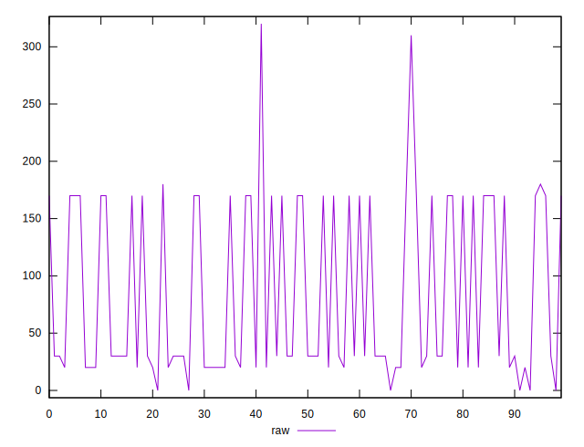
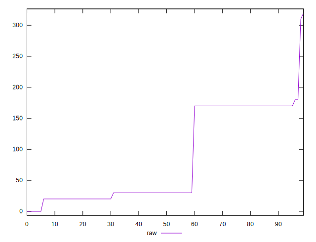
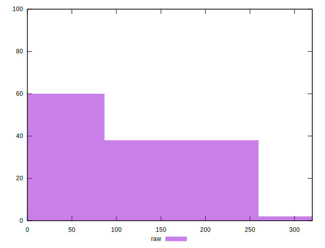
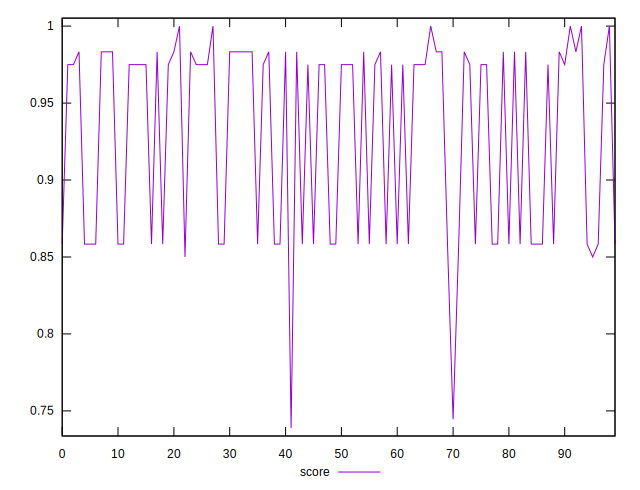
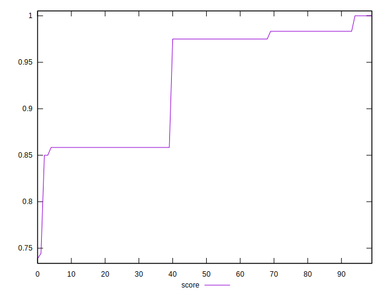
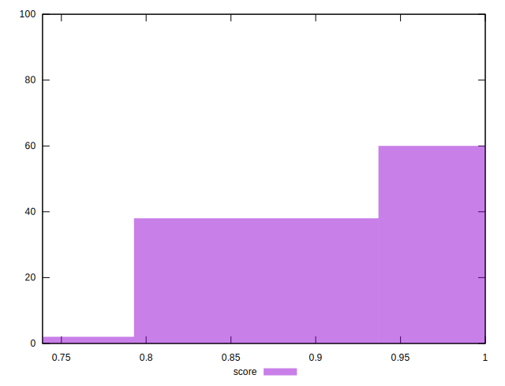

# //uses-http2/samples/pages+cached+noadtech

[→ Parent](../..)


## Raw


```yaml
p90min: 0
p90max: 170
p90range: 170
p90mean: 71.88888888888889
p90median: 30
p90stdev: 69.7598172214165
p90skewness: 0.6702547623838782
p90eccentricity: 0.9999999999999984
p90discretization: 22.5
outlandishness: 1.3914517843620182

```


## Score


```yaml
p90min: 0.7388888888888889
p90max: 0.9833333333333333
p90range: 0.24444444444444435
p90mean: 0.9223148148148157
p90median: 0.975
p90stdev: 0.06513209380441448
p90skewness: -0.5216599985718695
p90eccentricity: 0.9999999999999986
p90discretization: 15
outlandishness: 1.0154593506987246

```

