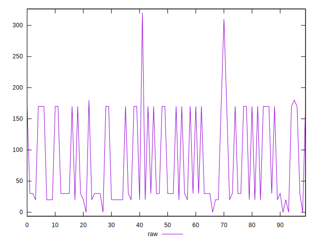

# //uses-http2/samples/pages+cached+noadtech

[→ Parent](../..)


## Raw


```yaml
p90min: 0
p90max: 170
p90range: 170
p90mean: 72.96703296703296
p90median: 30
p90stdev: 70.1253901361423
p90skewness: 0.6365434129367415
p90eccentricity: 0.9999999999999993
p90discretization: 22.75
outlandishness: 1.3506360284511538

```


## Score


```yaml
p90min: 0.8583333333333334
p90max: 1
p90range: 0.1416666666666666
p90mean: 0.9391941391941395
p90median: 0.975
p90stdev: 0.0584378251134519
p90skewness: -0.6365434129367517
p90eccentricity: 0.9999999999999997
p90discretization: 22.75
outlandishness: 0.9792873954922849

```

