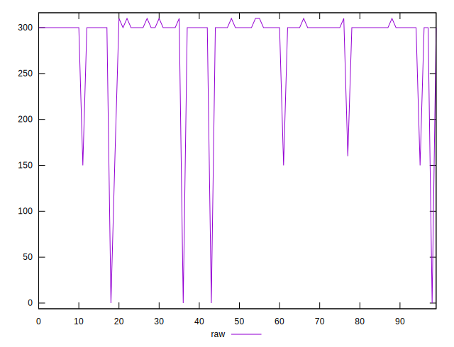
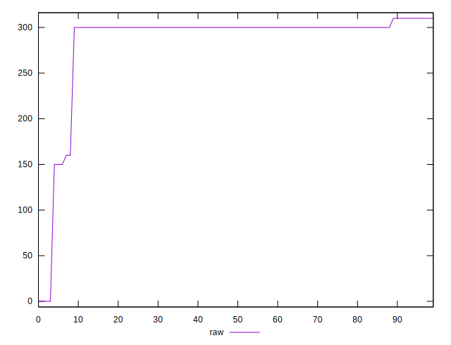
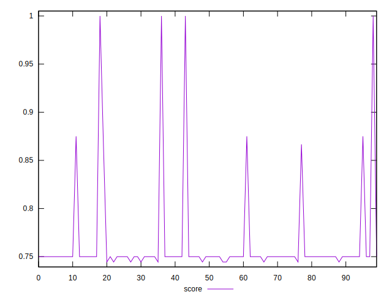

# //uses-http2/samples/pages+cached+noexternal+nocss

[→ Parent](../..)


## Raw


```yaml
p90min: 300
p90max: 310
p90range: 10
p90mean: 301.2087912087912
p90median: 300
p90stdev: 3.2598674668552388
p90skewness: 2.325989525498207
p90eccentricity: 0.9999999999999972
p90discretization: 45.5
outlandishness: 0.8752793673327894

```


## Score


```yaml
p90min: 0.7444444444444445
p90max: 0.75
p90range: 0.005555555555555536
p90mean: 0.7493284493284494
p90median: 0.75
p90stdev: 0.0018110374815862357
p90skewness: -2.325989525498366
p90eccentricity: 1.0000000000000024
p90discretization: 45.5
outlandishness: 1.0435528004408343

```

