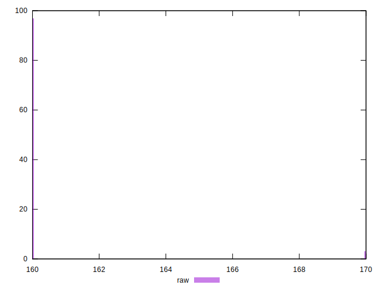
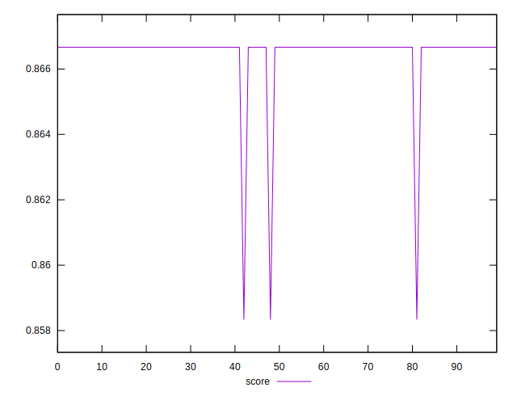
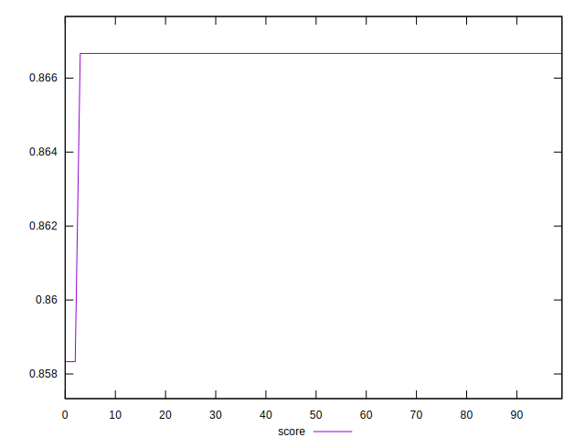

# //uses-http2/samples/pages+cached+noexternal+nofonts+nosvg+noimg

[→ Parent](../..)


## Raw


```yaml
p90min: 160
p90max: 160
p90range: 0
p90mean: 160
p90median: 160
p90stdev: 0
p90skewness: .nan
p90eccentricity: .nan
p90discretization: 90
outlandishness: 1.0037535156250001

```


## Score


```yaml
p90min: 0.8583333333333334
p90max: 0.8666666666666667
p90range: 0.008333333333333304
p90mean: 0.866388888888888
p90median: 0.8666666666666667
p90stdev: 0.0014958791130929125
p90skewness: -5.199469468956051
p90eccentricity: 1.0000000000000036
p90discretization: 45
outlandishness: 1.000064124144326

```

