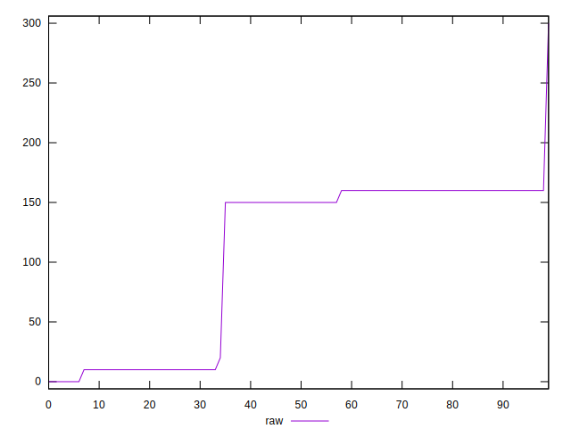
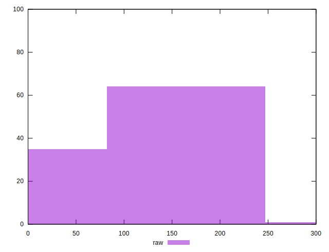

# //uses-http2/samples/pages+cached+noexternal+nofonts

[→ Parent](../..)


## Raw


```yaml
p90min: 10
p90max: 160
p90range: 150
p90mean: 113.07692307692308
p90median: 150
p90stdev: 66.83902768070294
p90skewness: -0.879094470740541
p90eccentricity: 0.9999999999999999
p90discretization: 22.75
outlandishness: 0.8787468184552731

```


## Score


```yaml
p90min: 0.8666666666666667
p90max: 0.9916666666666667
p90range: 0.125
p90mean: 0.90576923076923
p90median: 0.875
p90stdev: 0.055699189733919144
p90skewness: 0.8790944707405836
p90eccentricity: 0.9999999999999988
p90discretization: 22.75
outlandishness: 1.013064331861308

```


## P Score


```yaml
p90min: 0.8666666666666667
p90max: 0.9916666666666667
p90range: 0.125
p90mean: 0.90576923076923
p90median: 0.875
p90stdev: 0.055699189733919144
p90skewness: 0.8790944707405836
p90eccentricity: 0.9999999999999988
p90discretization: 22.75
outlandishness: 1.013064331861308

```


## Score Difference


```yaml
p90min: -0.0016666666666667052
p90max: 0.0050000000000000044
p90range: 0.00666666666666671
p90mean: 0.0024175824175823955
p90median: 0.0033333333333332993
p90stdev: 0.002461718334610665
p90skewness: -0.7218266522011304
p90eccentricity: 0.9999999999999992
p90discretization: 22.75
outlandishness: 0.7073829430670308

```


## P Score Difference


```yaml
p90min: 0
p90max: 0
p90range: 0
p90mean: 0
p90median: 0
p90stdev: 0
p90skewness: .nan
p90eccentricity: .nan
p90discretization: 91
outlandishness: .nan

```

