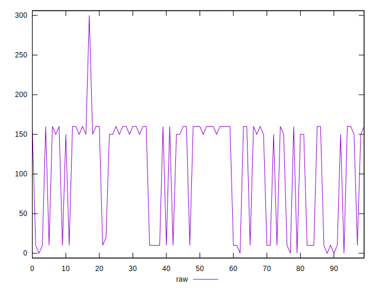
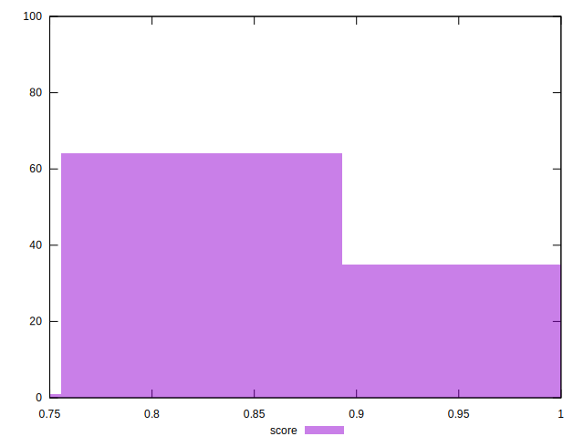

# //uses-http2/samples/pages+cached+noexternal+nofonts

[→ Parent](../..)


## Raw


```yaml
p90min: 0
p90max: 160
p90range: 160
p90mean: 98.44444444444444
p90median: 150
p90stdev: 72.07883201531052
p90skewness: -0.4517612689932809
p90eccentricity: 1.000000000000004
p90discretization: 18
outlandishness: 1.1593893472068646

```


## Score


```yaml
p90min: 0.75
p90max: 0.9916666666666667
p90range: 0.2416666666666667
p90mean: 0.9021296296296285
p90median: 0.875
p90stdev: 0.05682658685806234
p90skewness: 0.72380948780542
p90eccentricity: 0.9999999999999984
p90discretization: 18
outlandishness: 1.0212551456766104

```

