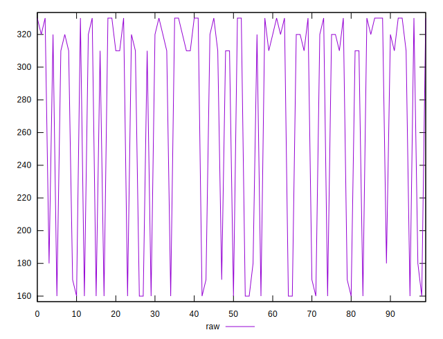
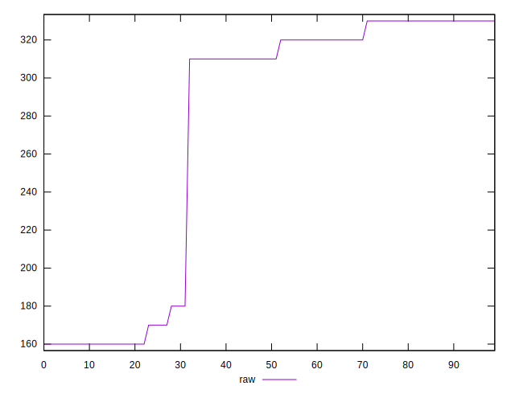
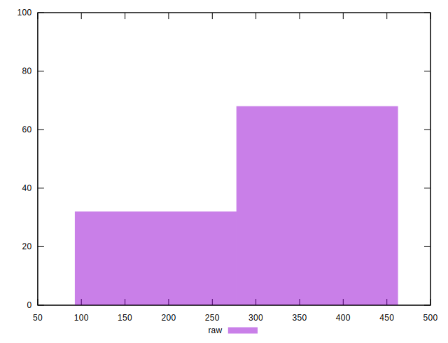
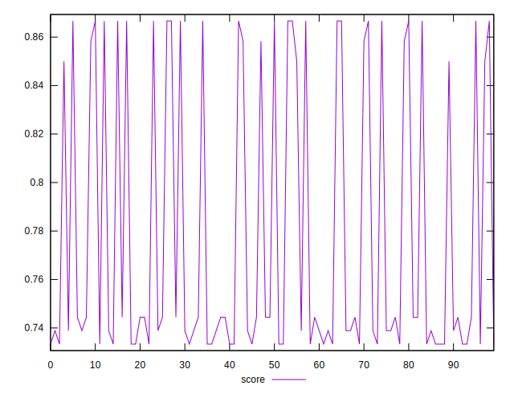
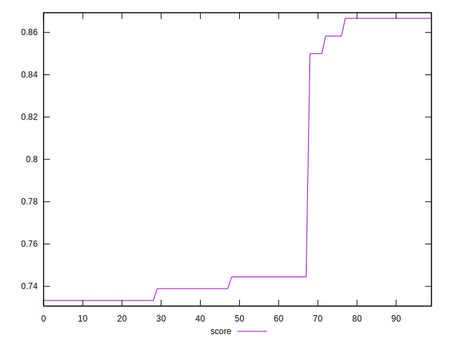
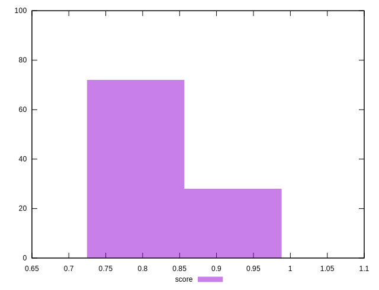

# //uses-http2/samples/pages+cached+noexternal+noimg

[→ Parent](../..)


## Raw


```yaml
p90min: 160
p90max: 330
p90range: 170
p90mean: 264.44444444444446
p90median: 310
p90stdev: 74.96830606049632
p90skewness: -0.5887084283294548
p90eccentricity: 1.000000000000002
p90discretization: 15
outlandishness: 1.0501943718663935

```


## Score


```yaml
p90min: 0.7333333333333333
p90max: 0.8666666666666667
p90range: 0.13333333333333341
p90mean: 0.7683641975308642
p90median: 0.7388888888888889
p90stdev: 0.0533636977034622
p90skewness: 1.181550374059681
p90eccentricity: 1.0000000000000002
p90discretization: 15
outlandishness: 1.0257511469844363

```

