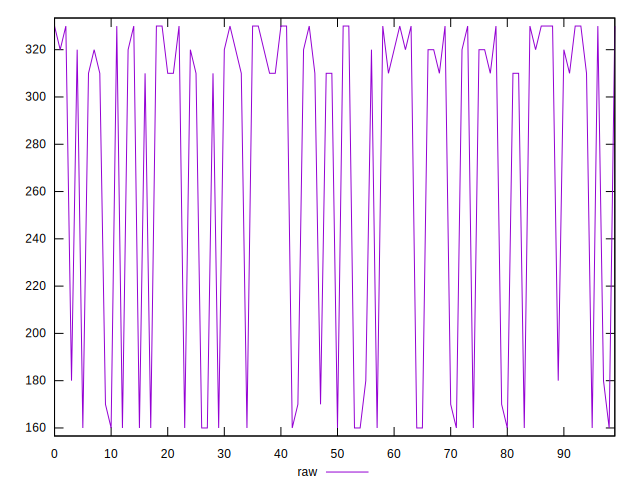

# //uses-http2/samples/pages+cached+noexternal+noimg

[→ Parent](../..)


## Raw


```yaml
p90min: 160
p90max: 330
p90range: 170
p90mean: 281.97802197802196
p90median: 320
p90stdev: 68.15012162429434
p90skewness: -1.1101079144507784
p90eccentricity: 0.9999999999999996
p90discretization: 15.166666666666666
outlandishness: 0.9236513350736201

```


## Score


```yaml
p90min: 0.7333333333333333
p90max: 0.8666666666666667
p90range: 0.13333333333333341
p90mean: 0.7694444444444446
p90median: 0.7388888888888889
p90stdev: 0.05405011567747417
p90skewness: 1.1307512977071865
p90eccentricity: 1.0000000000000002
p90discretization: 15.166666666666666
outlandishness: 1.0228730010817286

```

