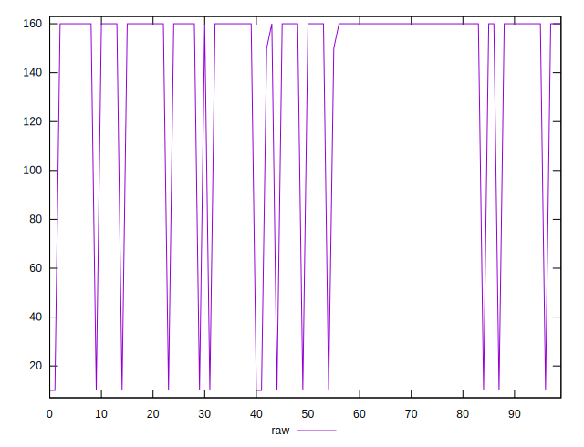
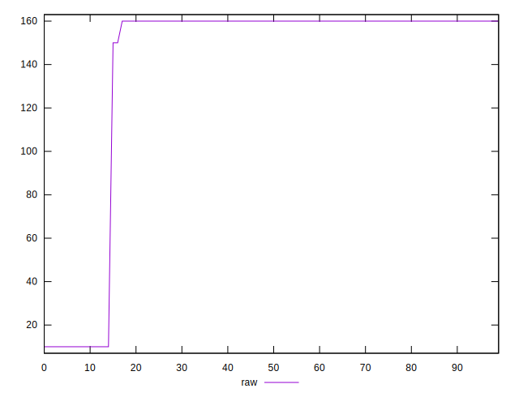
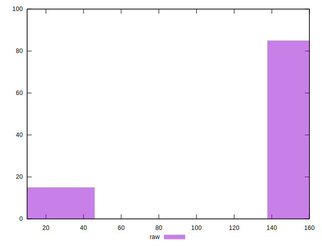
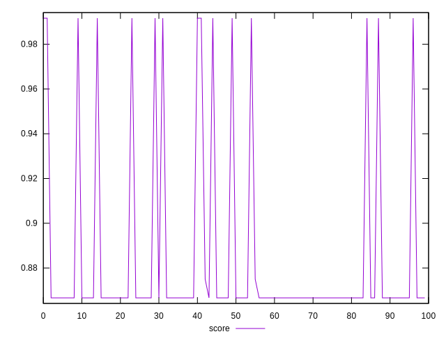
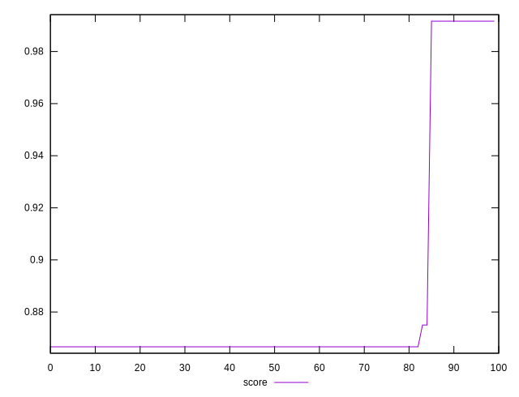
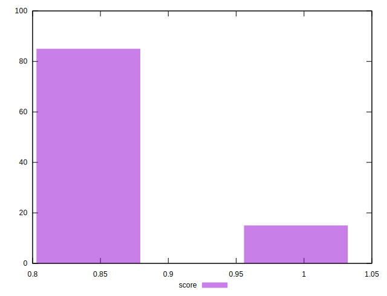

# //uses-http2/samples/pages+cached+noexternal+nojs

[→ Parent](../..)


## Raw


```yaml
p90min: 10
p90max: 160
p90range: 150
p90mean: 149.8901098901099
p90median: 160
p90stdev: 37.19548907704041
p90skewness: -3.4892043891349207
p90eccentricity: 1.0000000000000027
p90discretization: 30.333333333333332
outlandishness: 0.8390640586703761

```


## Score


```yaml
p90min: 0.8666666666666667
p90max: 0.9916666666666667
p90range: 0.125
p90mean: 0.8750915750915741
p90median: 0.8666666666666667
p90stdev: 0.030996240897533674
p90skewness: 3.4892043891350544
p90eccentricity: 0.9999999999999961
p90discretization: 30.333333333333332
outlandishness: 1.0241223960955137

```

