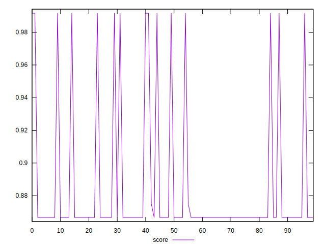
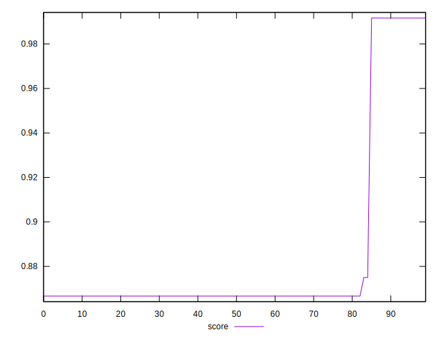

# //uses-http2/samples/pages+cached+noexternal+nojs

[→ Parent](../..)


## Raw


```yaml
p90min: 10
p90max: 160
p90range: 150
p90mean: 134.77777777777777
p90median: 160
p90stdev: 55.821695857391
p90skewness: -1.786178911344917
p90eccentricity: 0.999999999999994
p90discretization: 30
outlandishness: 1.0377780760638564

```


## Score


```yaml
p90min: 0.8666666666666667
p90max: 0.9916666666666667
p90range: 0.125
p90mean: 0.8737962962962955
p90median: 0.8666666666666667
p90stdev: 0.02861410747824246
p90skewness: 3.8690348285302467
p90eccentricity: 0.999999999999994
p90discretization: 30
outlandishness: 1.0271608782239139

```

