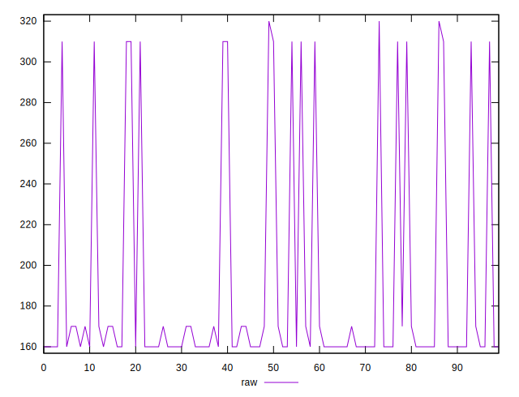
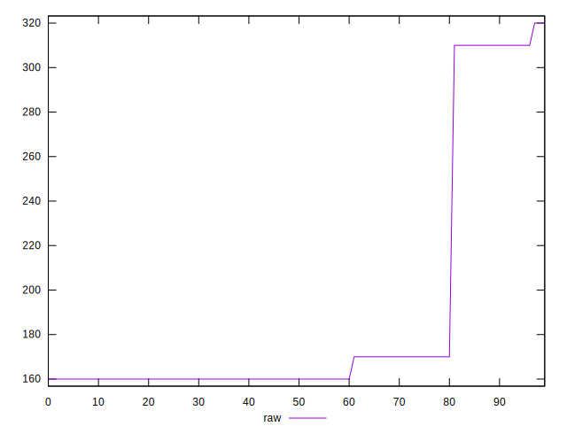
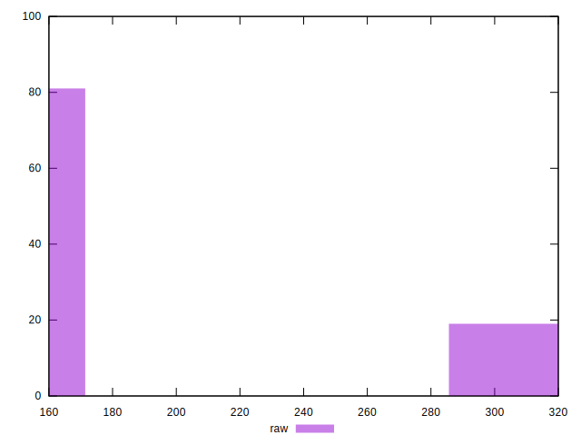
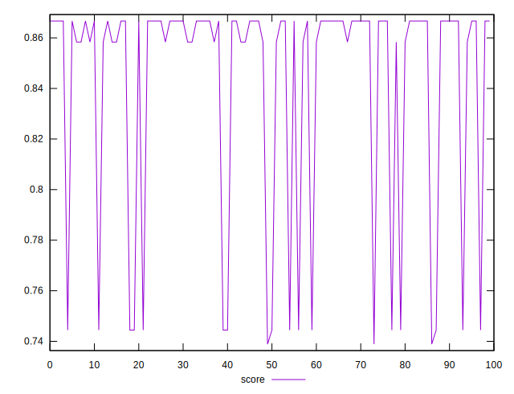
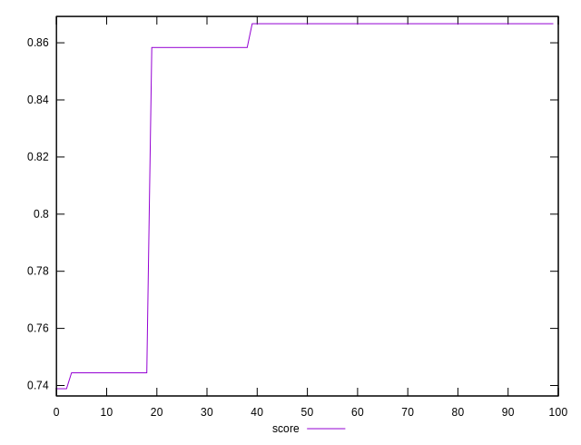
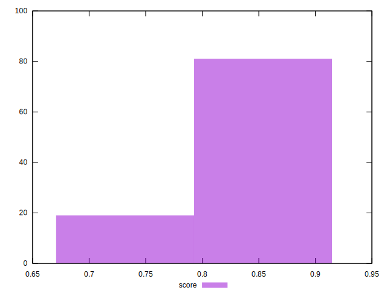

# //uses-http2/samples/pages+cached+noexternal+nosvg

[→ Parent](../..)


## Raw


```yaml
p90min: 160
p90max: 310
p90range: 150
p90mean: 177.22222222222223
p90median: 160
p90stdev: 44.44791653104356
p90skewness: 2.6253846514368346
p90eccentricity: 1.0000000000000013
p90discretization: 30
outlandishness: 1.159098609486935

```


## Score


```yaml
p90min: 0.7388888888888889
p90max: 0.8666666666666667
p90range: 0.12777777777777777
p90mean: 0.8388271604938264
p90median: 0.8666666666666667
p90stdev: 0.04939964987438919
p90skewness: -1.4007808088684792
p90eccentricity: 1.000000000000004
p90discretization: 22.5
outlandishness: 1.0066487365239558

```

