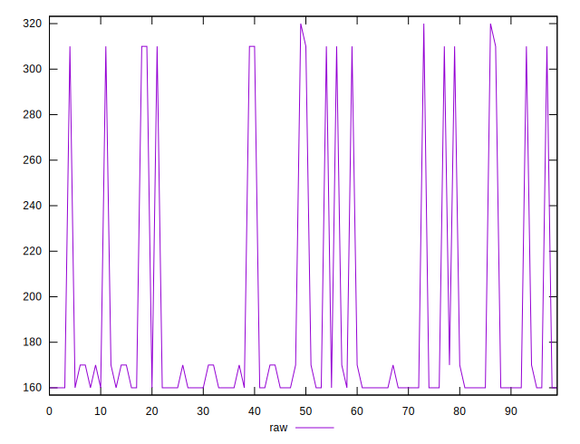
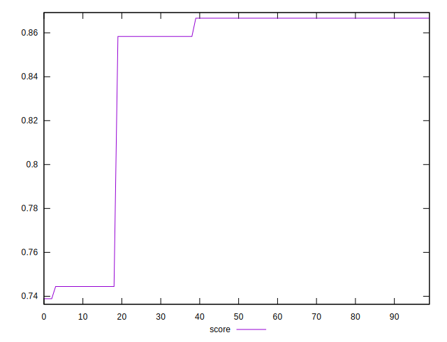

# //uses-http2/samples/pages+cached+noexternal+nosvg

[→ Parent](../..)


## Raw


```yaml
p90min: 160
p90max: 310
p90range: 150
p90mean: 178.6813186813187
p90median: 160
p90stdev: 46.31969156668155
p90skewness: 2.458616704249172
p90eccentricity: 0.9999999999999981
p90discretization: 30.333333333333332
outlandishness: 1.140245699268801

```


## Score


```yaml
p90min: 0.7444444444444445
p90max: 0.8666666666666667
p90range: 0.12222222222222223
p90mean: 0.8514041514041509
p90median: 0.8666666666666667
p90stdev: 0.037734419981748465
p90skewness: -2.4569679398662516
p90eccentricity: 1.0000000000000027
p90discretization: 30.333333333333332
outlandishness: 0.9771278554115088

```

