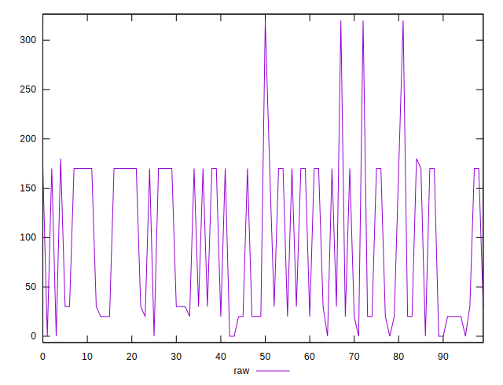
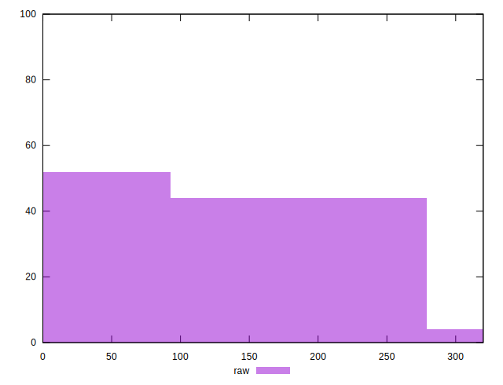
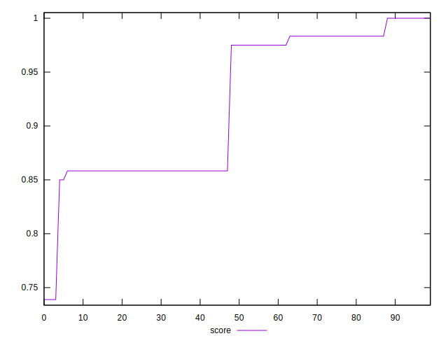

# //uses-http2/samples/pages+cached+noexternal

[→ Parent](../..)


## Raw


```yaml
p90min: 0
p90max: 170
p90range: 170
p90mean: 82.33333333333333
p90median: 30
p90stdev: 75.39599164117111
p90skewness: 0.2774088465189631
p90eccentricity: 1.0000000000000029
p90discretization: 22.5
outlandishness: 1.3966072218852954

```


## Score


```yaml
p90min: 0.7388888888888889
p90max: 1
p90range: 0.26111111111111107
p90mean: 0.9101543209876551
p90median: 0.8583333333333334
p90stdev: 0.07074602596980085
p90skewness: -0.3463228271505297
p90eccentricity: 0.9999999999999971
p90discretization: 15
outlandishness: 1.0198404010682034

```

