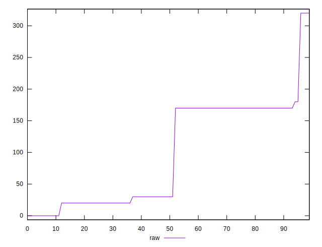

# //uses-http2/samples/pages+cached+noexternal

[→ Parent](../..)


## Raw


```yaml
p90min: 0
p90max: 180
p90range: 180
p90mean: 92.85714285714286
p90median: 30
p90stdev: 75.40783930865122
p90skewness: 0.04117163578331203
p90eccentricity: 1.000000000000001
p90discretization: 18.2
outlandishness: 1.0979815621301776

```


## Score


```yaml
p90min: 0.85
p90max: 1
p90range: 0.15000000000000002
p90mean: 0.922619047619048
p90median: 0.975
p90stdev: 0.06283986609054266
p90skewness: -0.04117163578332986
p90eccentricity: 1.000000000000001
p90discretization: 18.2
outlandishness: 0.99247014228697

```


## P Score


```yaml
p90min: 0.85
p90max: 1
p90range: 0.15000000000000002
p90mean: 0.922619047619048
p90median: 0.975
p90stdev: 0.06283986609054266
p90skewness: -0.04117163578332986
p90eccentricity: 1.000000000000001
p90discretization: 18.2
outlandishness: 0.99247014228697

```


## Score Difference


```yaml
p90min: -0.0033333333333332993
p90max: 0.0050000000000000044
p90range: 0.008333333333333304
p90mean: 0.00023199023199020602
p90median: 0.0016666666666665941
p90stdev: 0.002446089376147226
p90skewness: -0.26735286484371956
p90eccentricity: 1.0000000000000002
p90discretization: 18.2
outlandishness: 8.121000069253327

```


## P Score Difference


```yaml
p90min: 0
p90max: 0
p90range: 0
p90mean: 0
p90median: 0
p90stdev: 0
p90skewness: .nan
p90eccentricity: .nan
p90discretization: 91
outlandishness: .nan

```

