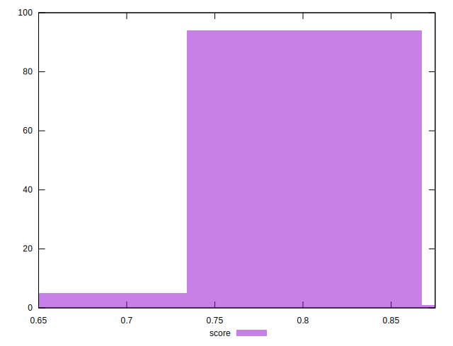

# //uses-http2/samples/pages+cached+nointeractive

[→ Parent](../..)


## Raw


```yaml
p90min: 150
p90max: 320
p90range: 170
p90mean: 218.24175824175825
p90median: 180
p90stdev: 67.99472194437737
p90skewness: 0.8182597504498934
p90eccentricity: 1.0000000000000027
p90discretization: 22.75
outlandishness: 1.1183967729798416

```


## Score


```yaml
p90min: 0.7388888888888889
p90max: 0.875
p90range: 0.13611111111111107
p90mean: 0.8198412698412698
p90median: 0.85
p90stdev: 0.054104322828276104
p90skewness: -0.8167925179009843
p90eccentricity: 0.9999999999999997
p90discretization: 22.75
outlandishness: 0.9777438185568407

```

