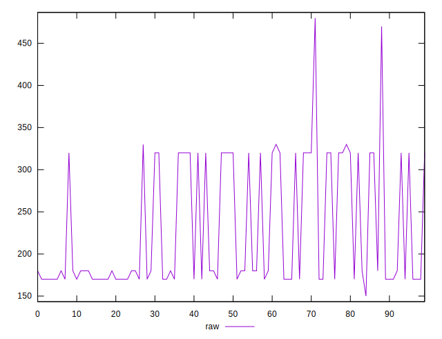
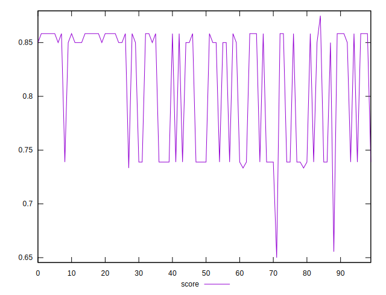

# //uses-http2/samples/pages+cached+nointeractive

[→ Parent](../..)


## Raw


```yaml
p90min: 150
p90max: 320
p90range: 170
p90mean: 217.11111111111111
p90median: 180
p90stdev: 67.51533890646134
p90skewness: 0.8573030802035879
p90eccentricity: 0.999999999999998
p90discretization: 22.5
outlandishness: 1.1300756289227463

```


## Score


```yaml
p90min: 0.65
p90max: 0.8583333333333334
p90range: 0.20833333333333337
p90mean: 0.8051851851851856
p90median: 0.85
p90stdev: 0.06102575408120491
p90skewness: -0.5294887675067264
p90eccentricity: 1.0000000000000016
p90discretization: 15
outlandishness: 1.0136618005380977

```

