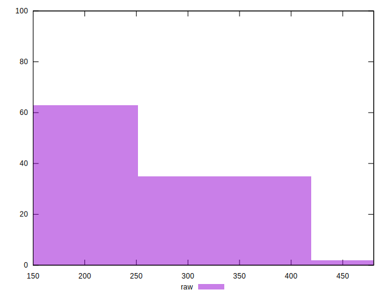
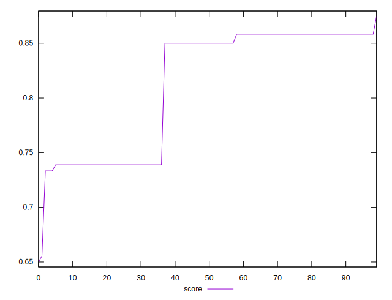

# //uses-http2/samples/pages+cached+nointeractive

[→ Parent](../..)


## Raw


```yaml
p90min: 150
p90max: 320
p90range: 170
p90mean: 218.24175824175825
p90median: 180
p90stdev: 67.99472194437737
p90skewness: 0.8182597504498934
p90eccentricity: 1.0000000000000024
p90discretization: 22.75
outlandishness: 1.1183967729798416

```


## Score


```yaml
p90min: 0.7388888888888889
p90max: 0.875
p90range: 0.13611111111111107
p90mean: 0.81984126984127
p90median: 0.85
p90stdev: 0.054104322828276125
p90skewness: -0.8167925179009763
p90eccentricity: 0.9999999999999993
p90discretization: 22.75
outlandishness: 0.9777438185568402

```


## P Score


```yaml
p90min: 0.7388888888888889
p90max: 0.875
p90range: 0.13611111111111107
p90mean: 0.81984126984127
p90median: 0.85
p90stdev: 0.054104322828276125
p90skewness: -0.8167925179009763
p90eccentricity: 0.9999999999999993
p90discretization: 22.75
outlandishness: 0.9777438185568402

```


## Score Difference


```yaml
p90min: 0
p90max: 0.0016666666666665941
p90range: 0.0016666666666665941
p90mean: 0.0011416361416360919
p90median: 0.0011111111111110628
p90stdev: 0.0006183259165710771
p90skewness: -0.9691894734832261
p90eccentricity: 0.9999999999999996
p90discretization: 30.333333333333332
outlandishness: 0.8192669964826009

```


## P Score Difference


```yaml
p90min: 0
p90max: 0
p90range: 0
p90mean: 0
p90median: 0
p90stdev: 0
p90skewness: .nan
p90eccentricity: .nan
p90discretization: 91
outlandishness: .nan

```

