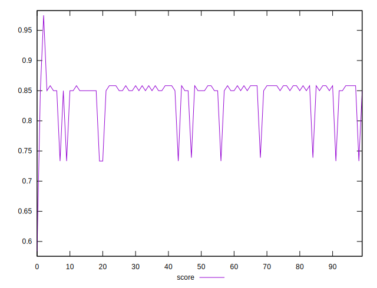

# //uses-http2/samples/pages+cached

[→ Parent](../..)


## Raw


```yaml
p90min: 170
p90max: 330
p90range: 160
p90mean: 181.75824175824175
p90median: 180
p90stdev: 30.583821284808632
p90skewness: 4.270242327105304
p90eccentricity: 0.9999999999999996
p90discretization: 22.75
outlandishness: 1.148655190231735

```


## Score


```yaml
p90min: 0.7333333333333333
p90max: 0.8583333333333334
p90range: 0.1250000000000001
p90mean: 0.8488095238095242
p90median: 0.85
p90stdev: 0.024216605445460827
p90skewness: -4.247070405334331
p90eccentricity: 0.9999999999999992
p90discretization: 22.75
outlandishness: 0.9777964462821296

```

