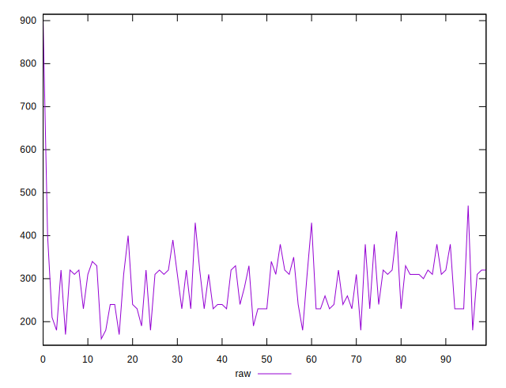
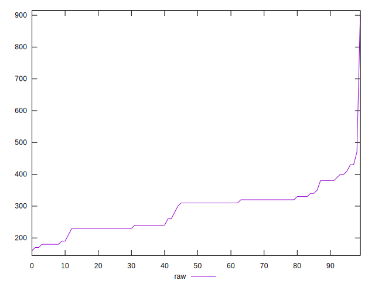

# //uses-http2/samples/pages

[→ Parent](../..)


## Raw


```yaml
p90min: 180
p90max: 400
p90range: 220
p90mean: 283.7362637362637
p90median: 310
p90stdev: 56.54227926323887
p90skewness: -0.027581823630576627
p90eccentricity: 0.9999999999999992
p90discretization: 5.6875
outlandishness: 1.054749683292724

```


## Score


```yaml
p90min: 0.6888888888888889
p90max: 0.85
p90range: 0.1611111111111111
p90mean: 0.7662393162393162
p90median: 0.7444444444444445
p90stdev: 0.04172040303081417
p90skewness: 0.2622083678359718
p90eccentricity: 1.0000000000000002
p90discretization: 5.352941176470588
outlandishness: 0.9968870430497946

```

