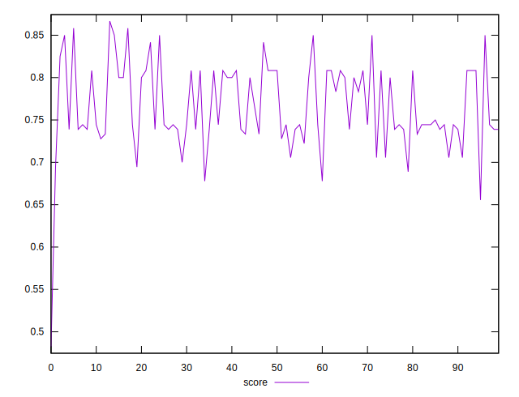

# //uses-http2/samples/pages

[→ Parent](../..)


## Raw


```yaml
p90min: 160
p90max: 380
p90range: 220
p90mean: 272.77777777777777
p90median: 305
p90stdev: 55.297735090804956
p90skewness: -0.2213335955607936
p90eccentricity: 0.9999999999999988
p90discretization: 5.625
outlandishness: 1.1411983126003291

```


## Score


```yaml
p90min: 0.4823529411764706
p90max: 0.8416666666666667
p90range: 0.3593137254901961
p90mean: 0.7553286129266512
p90median: 0.7444444444444445
p90stdev: 0.04971256571136542
p90skewness: -1.7426915890571422
p90eccentricity: 1.000000000000002
p90discretization: 4.7368421052631575
outlandishness: 1.0258950686640125

```

