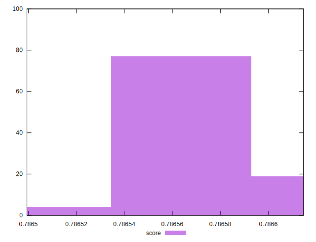

# //uses-long-cache-ttl/samples/pages+cached+noadtech

[→ Parent](../..)


## Raw


```yaml
p90min: 51073
p90max: 51089
p90range: 16
p90mean: 51080.63333333333
p90median: 51081
p90stdev: 4.906798005488567
p90skewness: -0.011565752529809122
p90eccentricity: 1.000000000000004
p90discretization: 15
outlandishness: 1.0000441137479468

```


## Score


```yaml
p90min: 0.786499404347403
p90max: 0.7866146671291339
p90range: 0.0001152627817309071
p90mean: 0.786567919958801
p90median: 0.7865762442162387
p90stdev: 0.000025731928797672275
p90skewness: -0.4332337582172882
p90eccentricity: 0.9999999999999992
p90discretization: 11.25
outlandishness: 1.0000118864011753

```

