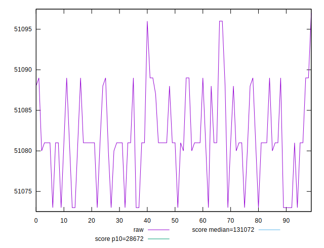
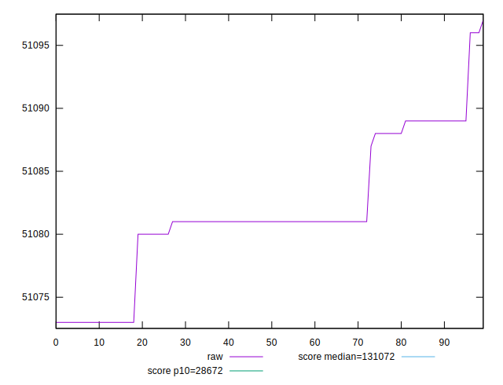
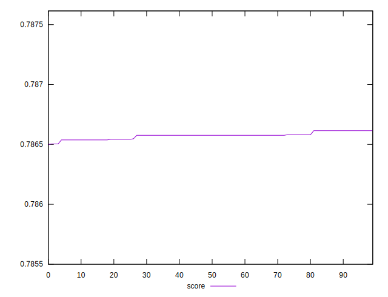

# //uses-long-cache-ttl/samples/pages+cached+noadtech

[→ Parent](../..)


## Raw


```yaml
p90min: 51073
p90max: 51089
p90range: 16
p90mean: 51081.604395604394
p90median: 51081
p90stdev: 4.927784248700313
p90skewness: -0.08318285002821088
p90eccentricity: 1.0000000000000016
p90discretization: 15.166666666666666
outlandishness: 1.0000060923940994

```


## Score


```yaml
p90min: 0.7865378232889095
p90max: 0.7866146671291339
p90range: 0.00007684384022432766
p90mean: 0.7865733418436361
p90median: 0.7865762442162387
p90stdev: 0.00002366680552991839
p90skewness: 0.08325421385012746
p90eccentricity: 1.0000000000000009
p90discretization: 15.166666666666666
outlandishness: 0.9999981001963639

```

