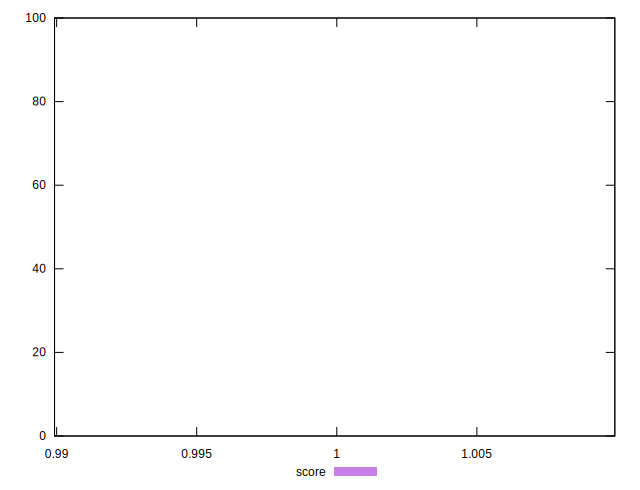

# //uses-long-cache-ttl/samples/pages+cached+noexternal+nocss

[→ Parent](../..)


## Raw


```yaml
p90min: 1464
p90max: 1464
p90range: 0
p90mean: 1464
p90median: 1464
p90stdev: 0
p90skewness: .nan
p90eccentricity: .nan
p90discretization: 91
outlandishness: 1

```


## Score


```yaml
p90min: 0.9999246292865362
p90max: 0.9999246292865362
p90range: 0
p90mean: 0.9999246292865381
p90median: 0.9999246292865362
p90stdev: 1.887379141862766e-15
p90skewness: -1
p90eccentricity: 1
p90discretization: 91
outlandishness: 1.0000000000000004

```


## P Score


```yaml
p90min: 0.9999246292865362
p90max: 0.9999246292865362
p90range: 0
p90mean: 0.9999246292865381
p90median: 0.9999246292865362
p90stdev: 1.887379141862766e-15
p90skewness: -1
p90eccentricity: 1
p90discretization: 91
outlandishness: 1.0000000000000004

```


## Score Difference


```yaml
p90min: 0.00007537071346375157
p90max: 0.00007537071346375157
p90range: 0
p90mean: 0.00007537071346375157
p90median: 0.00007537071346375157
p90stdev: 0
p90skewness: .nan
p90eccentricity: .nan
p90discretization: 91
outlandishness: 1

```


## P Score Difference


```yaml
p90min: 0
p90max: 0
p90range: 0
p90mean: 0
p90median: 0
p90stdev: 0
p90skewness: .nan
p90eccentricity: .nan
p90discretization: 91
outlandishness: .nan

```

