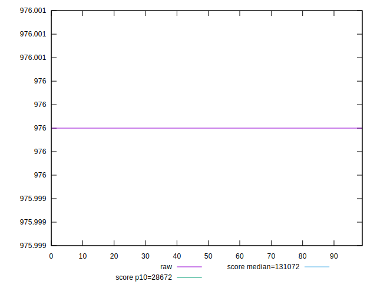
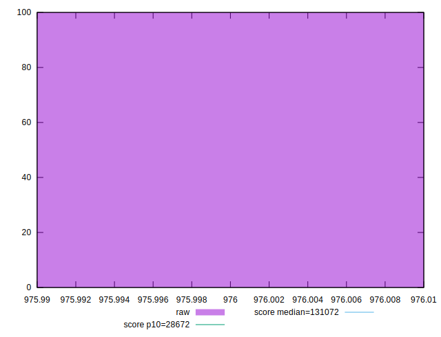
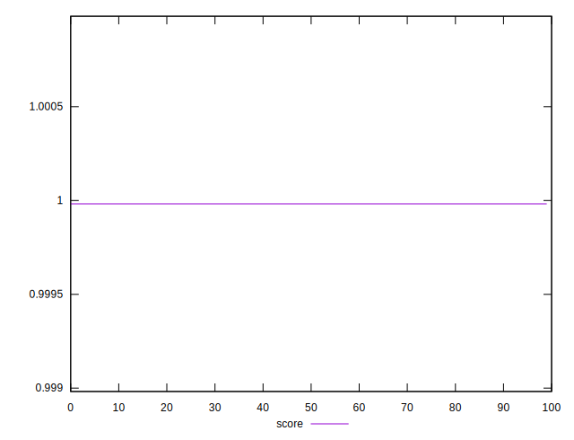
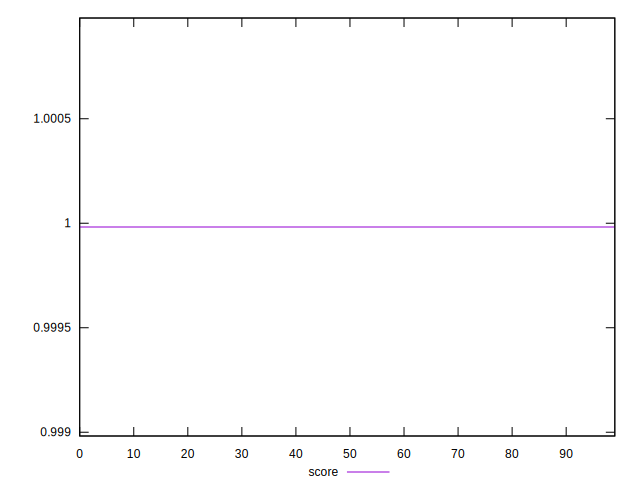
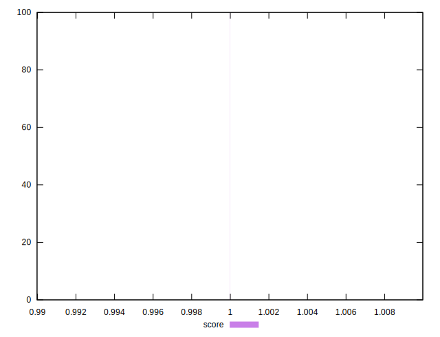

# //uses-long-cache-ttl/samples/pages+cached+noexternal+nofonts+nosvg+noimg+nocss+nojs

[→ Parent](../..)


## Raw


```yaml
p90min: 976
p90max: 976
p90range: 0
p90mean: 976
p90median: 976
p90stdev: 0
p90skewness: .nan
p90eccentricity: .nan
p90discretization: 90
outlandishness: 1

```


## Score


```yaml
p90min: 0.9999819950158803
p90max: 0.9999819950158803
p90range: 0
p90mean: 0.9999819950158815
p90median: 0.9999819950158803
p90stdev: 1.2212453270876722e-15
p90skewness: -1
p90eccentricity: 1
p90discretization: 90
outlandishness: 1.0000000000000013

```

