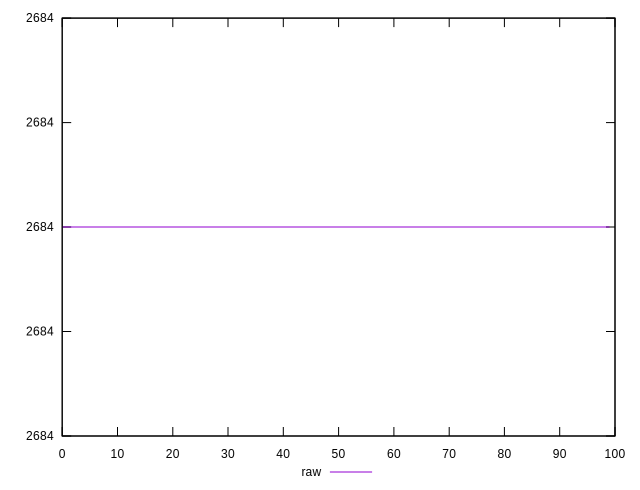
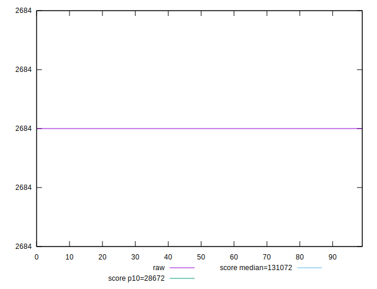
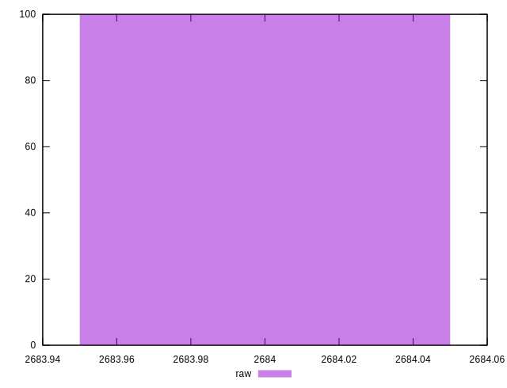
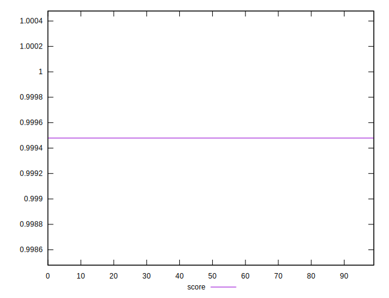
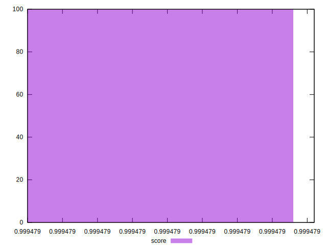

# //uses-long-cache-ttl/samples/pages+cached+noexternal+nofonts+nosvg+noimg+nocss

[→ Parent](../..)


## Raw


```yaml
p90min: 2684
p90max: 2684
p90range: 0
p90mean: 2684
p90median: 2684
p90stdev: 0
p90skewness: .nan
p90eccentricity: .nan
p90discretization: 91
outlandishness: 1

```


## Score


```yaml
p90min: 0.9994787290782654
p90max: 0.9994787290782654
p90range: 0
p90mean: 0.9994787290782637
p90median: 0.9994787290782654
p90stdev: 1.6653345369377348e-15
p90skewness: 1
p90eccentricity: 1
p90discretization: 91
outlandishness: 0.9999999999999998

```

