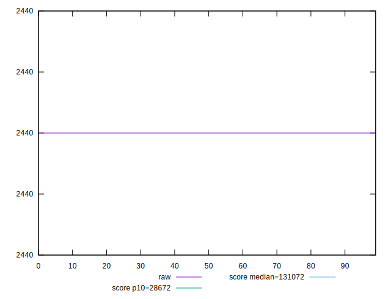
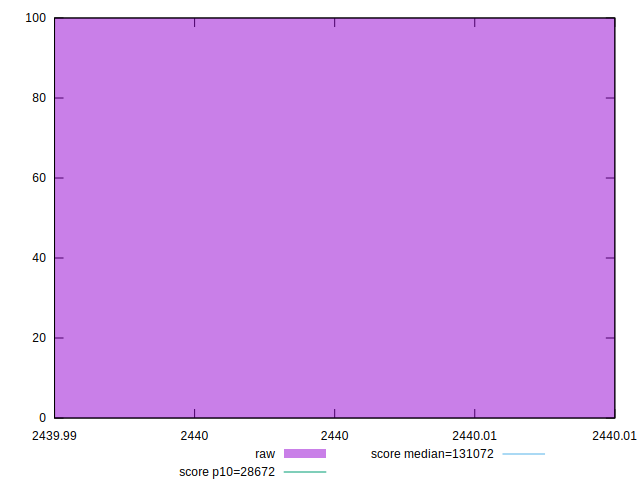
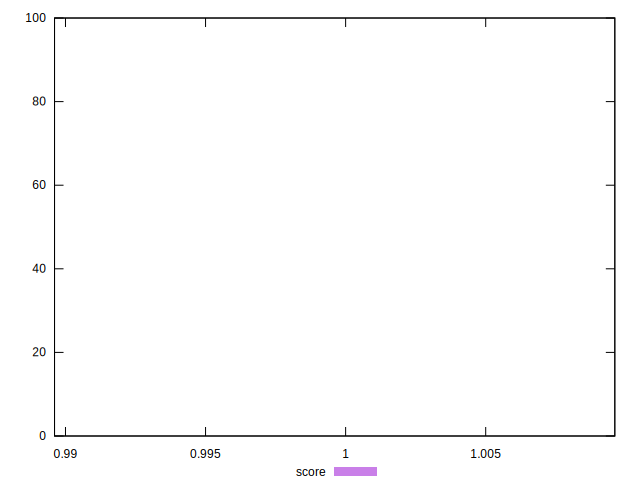

# //uses-long-cache-ttl/samples/pages+cached+noexternal+nofonts+nosvg+noimg

[→ Parent](../..)


## Raw


```yaml
p90min: 2440
p90max: 2440
p90range: 0
p90mean: 2440
p90median: 2440
p90stdev: 0
p90skewness: .nan
p90eccentricity: .nan
p90discretization: 90
outlandishness: 1

```


## Score


```yaml
p90min: 0.9996090852968826
p90max: 0.9996090852968826
p90range: 0
p90mean: 0.9996090852968821
p90median: 0.9996090852968826
p90stdev: 5.551115123125783e-16
p90skewness: 1
p90eccentricity: 1
p90discretization: 90
outlandishness: 1

```

