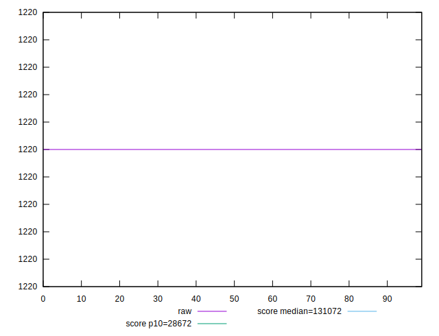
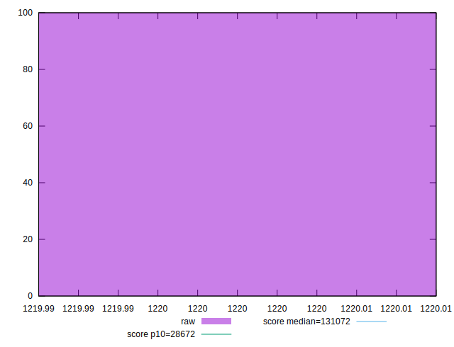

# //uses-long-cache-ttl/samples/pages+cached+noexternal+nofonts

[→ Parent](../..)


## Raw


```yaml
p90min: 1220
p90max: 1220
p90range: 0
p90mean: 1220
p90median: 1220
p90stdev: 0
p90skewness: .nan
p90eccentricity: .nan
p90discretization: 90
outlandishness: 1

```


## Score


```yaml
p90min: 0.9999598599348188
p90max: 0.9999598599348188
p90range: 0
p90mean: 0.9999598599348188
p90median: 0.9999598599348188
p90stdev: 0
p90skewness: .nan
p90eccentricity: .nan
p90discretization: 90
outlandishness: 1

```

