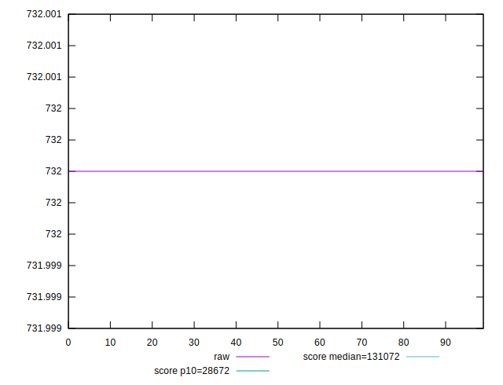
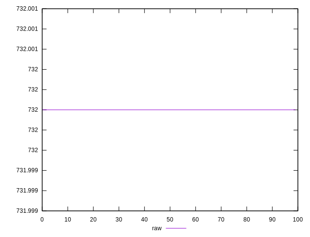
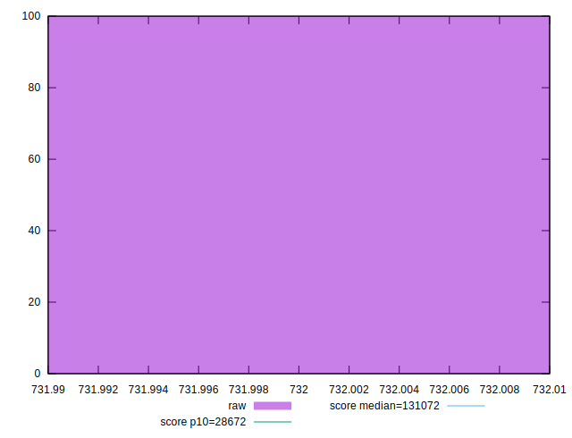
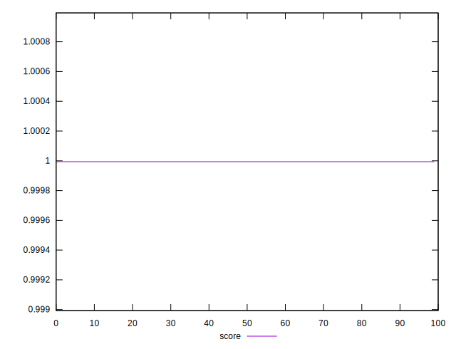
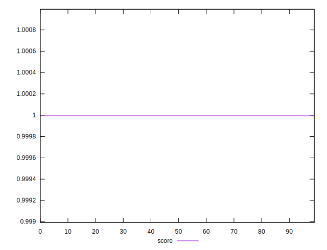
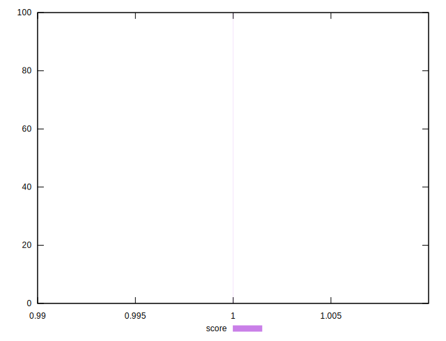

# //uses-long-cache-ttl/samples/pages+cached+noexternal+nojs

[→ Parent](../..)


## Raw


```yaml
p90min: 732
p90max: 732
p90range: 0
p90mean: 732
p90median: 732
p90stdev: 0
p90skewness: .nan
p90eccentricity: .nan
p90discretization: 91
outlandishness: 1

```


## Score


```yaml
p90min: 0.9999939069787662
p90max: 0.9999939069787662
p90range: 0
p90mean: 0.9999939069787679
p90median: 0.9999939069787662
p90stdev: 1.6653345369377348e-15
p90skewness: -1
p90eccentricity: 1
p90discretization: 91
outlandishness: 1.0000000000000009

```

