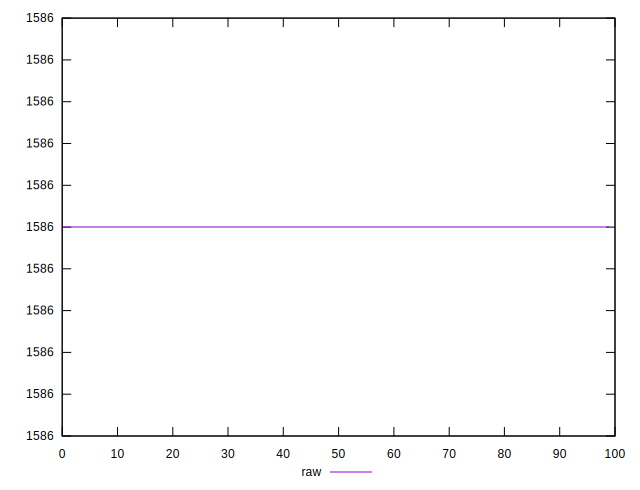
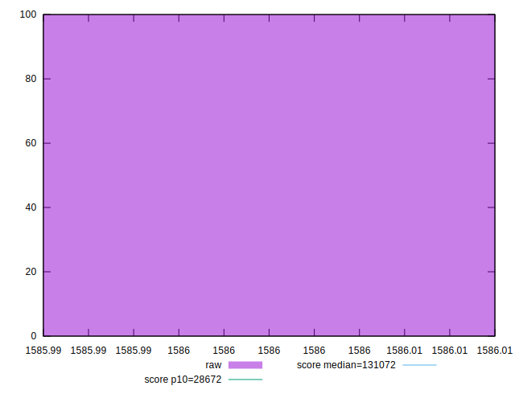
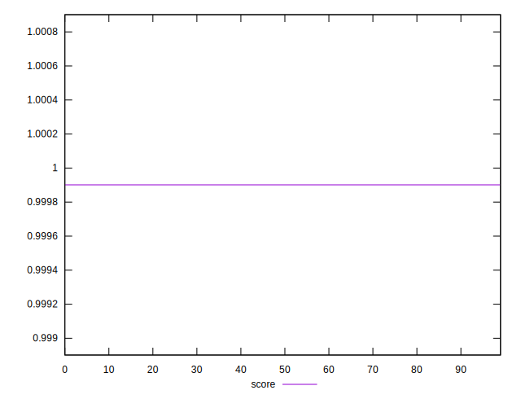
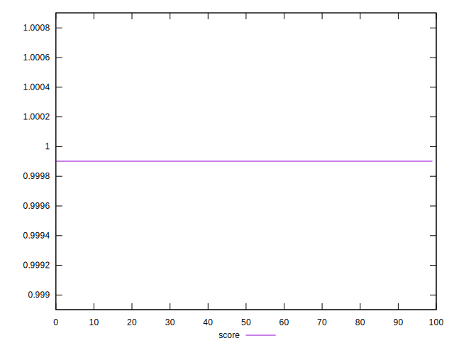
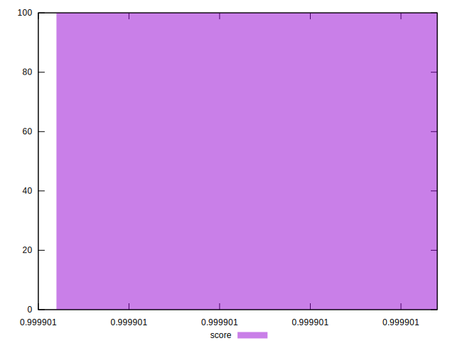

# //uses-long-cache-ttl/samples/pages+cached+noexternal+nosvg

[→ Parent](../..)


## Raw


```yaml
p90min: 1586
p90max: 1586
p90range: 0
p90mean: 1586
p90median: 1586
p90stdev: 0
p90skewness: .nan
p90eccentricity: .nan
p90discretization: 91
outlandishness: 1

```


## Score


```yaml
p90min: 0.9999013149726905
p90max: 0.9999013149726905
p90range: 0
p90mean: 0.9999013149726895
p90median: 0.9999013149726905
p90stdev: 9.992007221626409e-16
p90skewness: 1
p90eccentricity: 1
p90discretization: 91
outlandishness: 1

```

