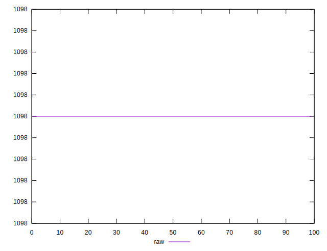
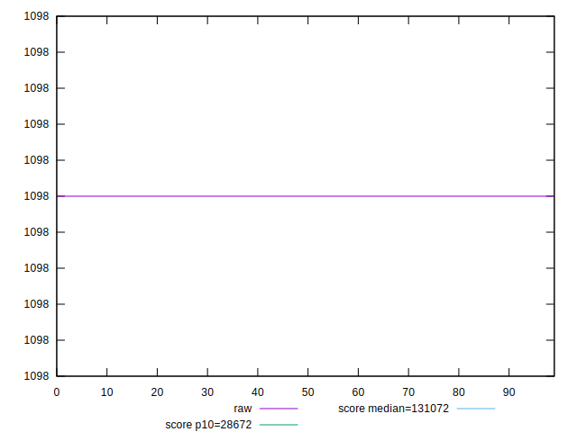
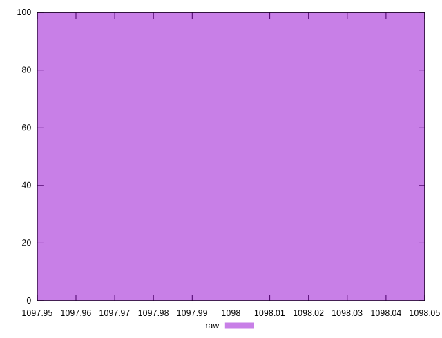
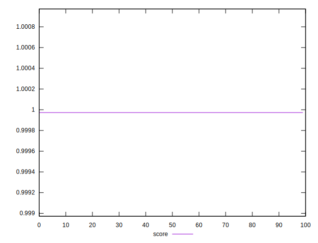
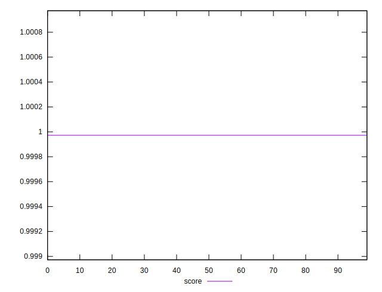
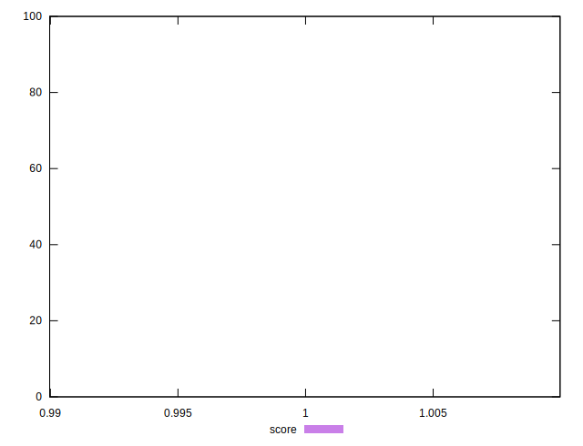

# //uses-long-cache-ttl/samples/pages+cached+noexternal

[→ Parent](../..)


## Raw


```yaml
p90min: 1098
p90max: 1098
p90range: 0
p90mean: 1098
p90median: 1098
p90stdev: 0
p90skewness: .nan
p90eccentricity: .nan
p90discretization: 91
outlandishness: 1

```


## Score


```yaml
p90min: 0.999972393989216
p90max: 0.999972393989216
p90range: 0
p90mean: 0.9999723939892153
p90median: 0.999972393989216
p90stdev: 6.661338147750939e-16
p90skewness: 1
p90eccentricity: 1
p90discretization: 91
outlandishness: 0.9999999999999991

```

