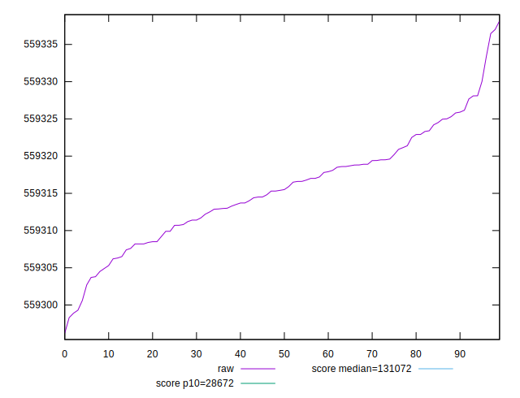
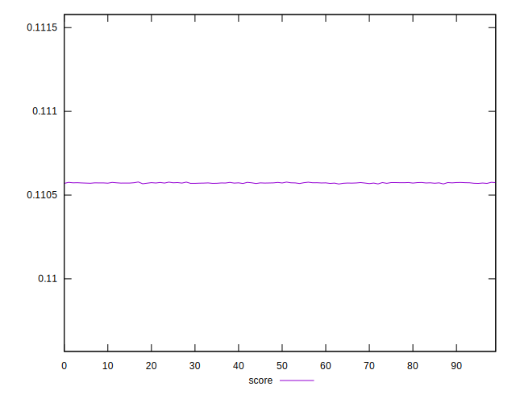
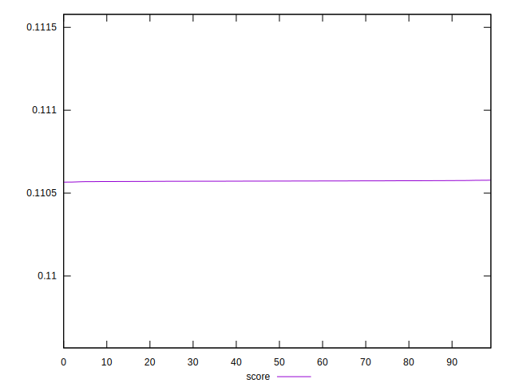

# //uses-long-cache-ttl/samples/pages+cached+nointeractive

[→ Parent](../..)


## Raw


```yaml
p90min: 559296.2035413408
p90max: 559325.8035413409
p90range: 29.600000000093132
p90mean: 559313.9634224245
p90median: 559314.5038206705
p90stdev: 6.763036779090265
p90skewness: -0.44401903315727625
p90eccentricity: 1
p90discretization: 1.0465116279069768
outlandishness: 1.0000061275351273

```


## Score


```yaml
p90min: 0.11056629013412189
p90max: 0.11057564012071897
p90range: 0.000009349986597073645
p90mean: 0.11057223408728159
p90median: 0.11057239960032167
p90stdev: 0.0000020296353816465258
p90skewness: -0.7176350489672446
p90eccentricity: 0.9999999999999997
p90discretization: 1.0465116279069768
outlandishness: 1.000008225350891

```

