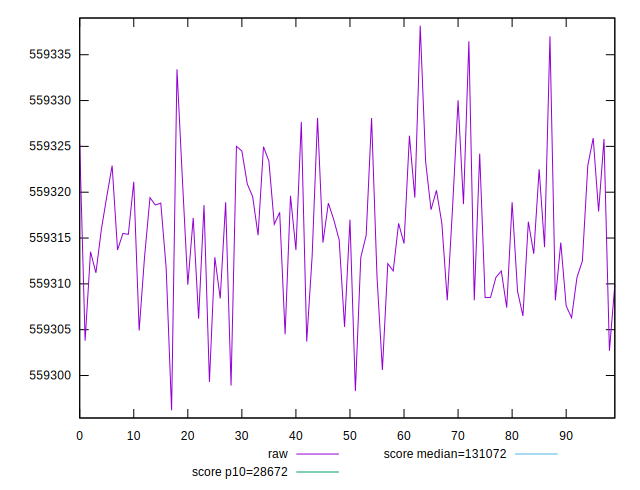
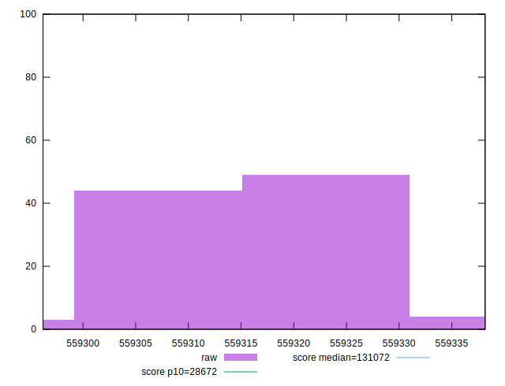

# //uses-long-cache-ttl/samples/pages+cached+nointeractive

[→ Parent](../..)


## Raw


```yaml
p90min: 559302.7010273744
p90max: 559330.0246648666
p90range: 27.32363749225624
p90mean: 559315.7070796872
p90median: 559315.5049379889
p90stdev: 6.458426093169714
p90skewness: 0.06425693019538774
p90eccentricity: 0.9999999999999997
p90discretization: 1.0459770114942528
outlandishness: 0.9999998925404472

```


## Score


```yaml
p90min: 0.11056860643803901
p90max: 0.11057638106700829
p90range: 0.000007774628969281494
p90mean: 0.11057268026869545
p90median: 0.11057273776440929
p90stdev: 0.0000018376743713308507
p90skewness: -0.06421118911352658
p90eccentricity: 1
p90discretization: 1.0459770114942528
outlandishness: 1.0000001549273005

```

