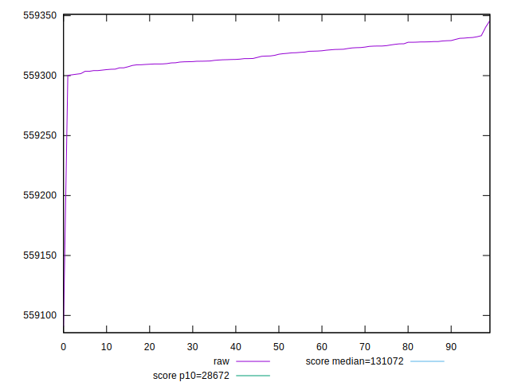

# //uses-long-cache-ttl/samples/pages+cached

[→ Parent](../..)


## Raw


```yaml
p90min: 559300.2057759777
p90max: 559330.2024240224
p90range: 29.996648044674657
p90mean: 559316.3265217005
p90median: 559316.1038206704
p90stdev: 8.197235679755387
p90skewness: -0.06840968524257371
p90eccentricity: 1.0000000000000002
p90discretization: 1
outlandishness: 0.9999971978944179

```


## Score


```yaml
p90min: 0.11056855586122771
p90max: 0.11057709110074582
p90range: 0.000008535239518103754
p90mean: 0.11057250402649339
p90median: 0.11057256735883697
p90stdev: 0.000002332432470424454
p90skewness: 0.06845050994953432
p90eccentricity: 0.9999999999999999
p90discretization: 1
outlandishness: 1.0000040380555324

```


## P Score


```yaml
p90min: 0.11056855586122771
p90max: 0.11057709110074582
p90range: 0.000008535239518103754
p90mean: 0.11057250402649339
p90median: 0.11057256735883697
p90stdev: 0.000002332432470424454
p90skewness: 0.06845050994953432
p90eccentricity: 0.9999999999999999
p90discretization: 1
outlandishness: 1.0000040380555324

```


## Score Difference


```yaml
p90min: -0.0005770911007458163
p90max: -0.0005685558612277125
p90range: 0.000008535239518103754
p90mean: -0.0005725040264933979
p90median: -0.0005725673588369701
p90stdev: 0.0000023324324704244534
p90skewness: -0.06845050997798224
p90eccentricity: 1.0000000000000002
p90discretization: 1
outlandishness: 1.0007800548054604

```


## P Score Difference


```yaml
p90min: 0
p90max: 0
p90range: 0
p90mean: 0
p90median: 0
p90stdev: 0
p90skewness: .nan
p90eccentricity: .nan
p90discretization: 91
outlandishness: .nan

```

