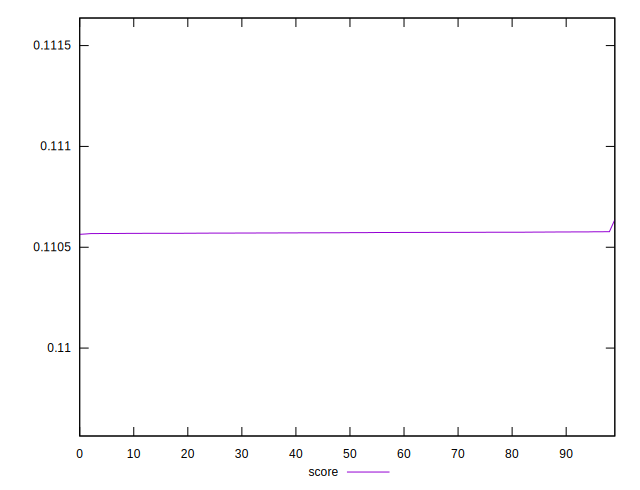

# //uses-long-cache-ttl/samples/pages+cached

[→ Parent](../..)


## Raw


```yaml
p90min: 559090.7185985723
p90max: 559329.1054966481
p90range: 238.3868980758125
p90mean: 559313.5222776049
p90median: 559314.7485000001
p90stdev: 24.9325772599926
p90skewness: -7.899328471120438
p90eccentricity: 1.0000000000000002
p90discretization: 1
outlandishness: 1.0000072253411214

```


## Score


```yaml
p90min: 0.11056405971196986
p90max: 0.11057572524731779
p90range: 0.000011665535347926692
p90mean: 0.11057164976068573
p90median: 0.11057167039103805
p90stdev: 0.000002421821597049616
p90skewness: -0.4008434374885619
p90eccentricity: 1.0000000000000002
p90discretization: 1
outlandishness: 1.0000194899830217

```

