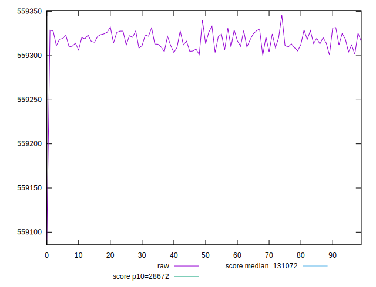
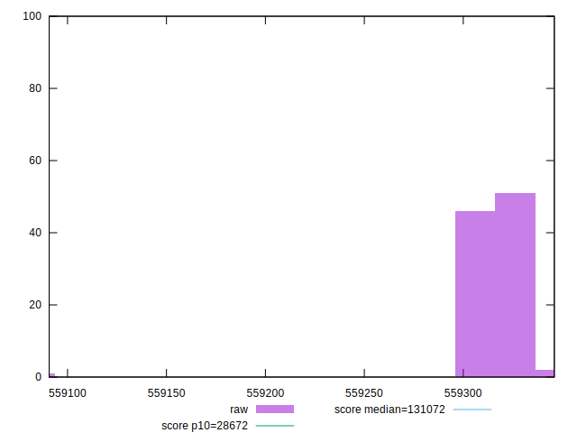
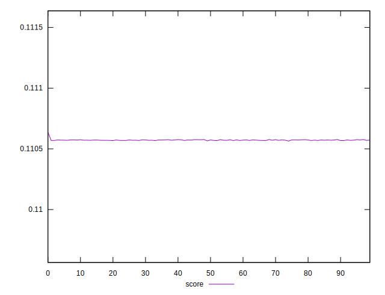

# //uses-long-cache-ttl/samples/pages+cached

[→ Parent](../..)


## Raw


```yaml
p90min: 559300.2057759777
p90max: 559330.2024240224
p90range: 29.996648044674657
p90mean: 559316.3265217005
p90median: 559316.1038206704
p90stdev: 8.197235679755387
p90skewness: -0.06840968524257371
p90eccentricity: 1.0000000000000002
p90discretization: 1
outlandishness: 0.9999971978944179

```


## Score


```yaml
p90min: 0.11056855586122771
p90max: 0.11057709110074582
p90range: 0.000008535239518103754
p90mean: 0.11057250402649339
p90median: 0.11057256735883697
p90stdev: 0.000002332432470424454
p90skewness: 0.06845050994953432
p90eccentricity: 0.9999999999999999
p90discretization: 1
outlandishness: 1.0000040380555324

```

