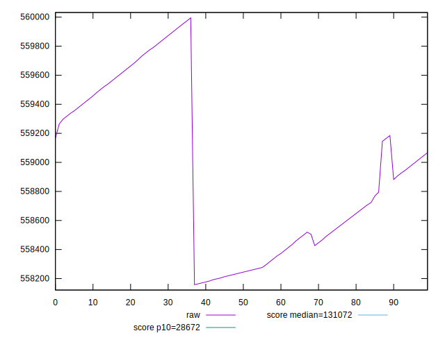

# //uses-long-cache-ttl/samples/pages

[→ Parent](../..)


## Raw


```yaml
p90min: 558157.9094985723
p90max: 559790.1715041279
p90range: 1632.2620055555599
p90mean: 558828.4336895908
p90median: 558677.8943805168
p90stdev: 524.221603789712
p90skewness: 0.37173179087880714
p90eccentricity: 1
p90discretization: 1
outlandishness: 1.0003846974439359

```


## Score


```yaml
p90min: 0.11037960372103645
p90max: 0.11088348161259687
p90range: 0.0005038778915604225
p90mean: 0.11065731700011291
p90median: 0.11066970910278151
p90stdev: 0.00016151604794201017
p90skewness: -0.16928884379059594
p90eccentricity: 0.9999999999999993
p90discretization: 1
outlandishness: 1.00042814370502

```

