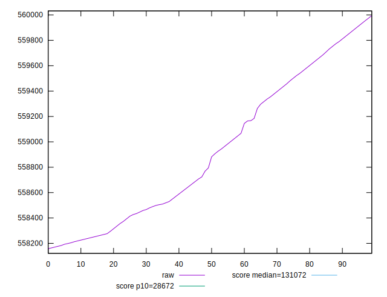
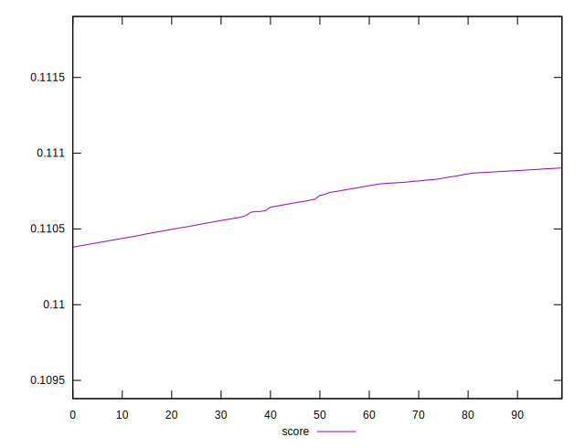

# //uses-long-cache-ttl/samples/pages

[→ Parent](../..)


## Raw


```yaml
p90min: 558157.9094985723
p90max: 559810.7634430168
p90range: 1652.8539444444468
p90mean: 558839.2285220461
p90median: 558687.7901541279
p90stdev: 531.2965040904942
p90skewness: 0.3616499272356802
p90eccentricity: 0.9999999999999999
p90discretization: 1
outlandishness: 1.0003460499032861

```


## Score


```yaml
p90min: 0.11043194383104565
p90max: 0.11090281313749306
p90range: 0.0004708693064474079
p90mean: 0.11070852068096584
p90median: 0.11075155122332236
p90stdev: 0.000151384032701235
p90skewness: -0.3600227609745575
p90eccentricity: 0.9999999999999997
p90discretization: 1
outlandishness: 0.9995029437850553

```

