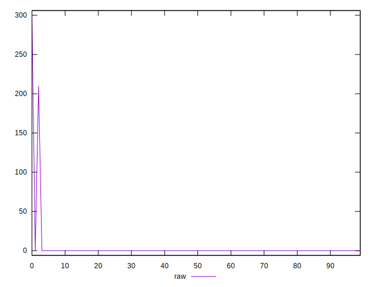
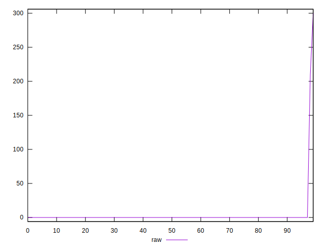
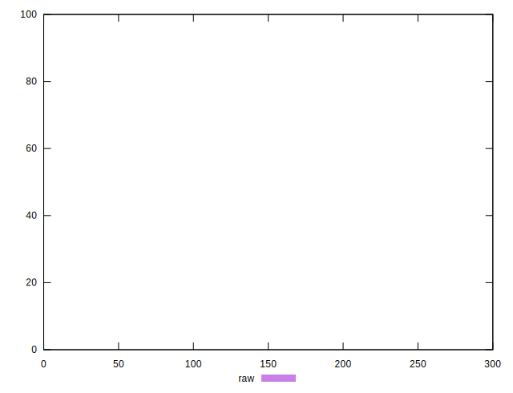
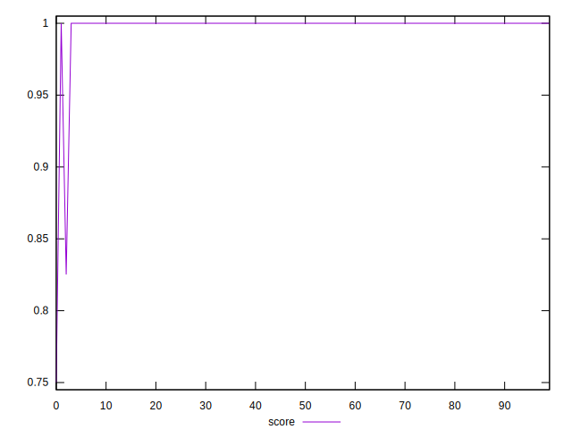
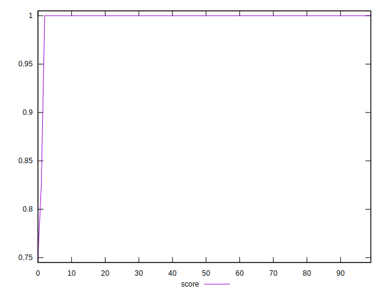

# //uses-rel-preconnect/samples/pages+cached

[→ Parent](../..)


## Raw


```yaml
p90min: 0
p90max: 0
p90range: 0
p90mean: 0
p90median: 0
p90stdev: 0
p90skewness: .nan
p90eccentricity: .nan
p90discretization: 90
outlandishness: .inf

```


## Score


```yaml
p90min: 0.75
p90max: 1
p90range: 0.25
p90mean: 0.9952794444384399
p90median: 1
p90stdev: 0.03180967614074256
p90skewness: -6.79073431269277
p90eccentricity: 1.0000000000000038
p90discretization: 30
outlandishness: 1.0009488139345564

```

