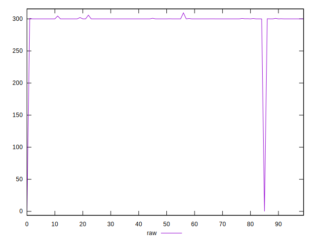

# //uses-rel-preconnect/samples/pages

[→ Parent](../..)


## Raw


```yaml
p90min: 0
p90max: 300.228
p90range: 300.228
p90mean: 293.3441111111111
p90median: 300
p90stdev: 44.22330745293191
p90skewness: -6.48248526699355
p90eccentricity: 0.9999999999999999
p90discretization: 9
outlandishness: 1.0063241139032428

```


## Score


```yaml
p90min: 0.7447911111111111
p90max: 0.75
p90range: 0.0052088888888889295
p90mean: 0.7498331975308642
p90median: 0.75
p90stdev: 0.0006983034472675807
p90skewness: -5.5918291039400945
p90eccentricity: 0.9999999999999982
p90discretization: 4.7368421052631575
outlandishness: 1.0134255513082444

```

