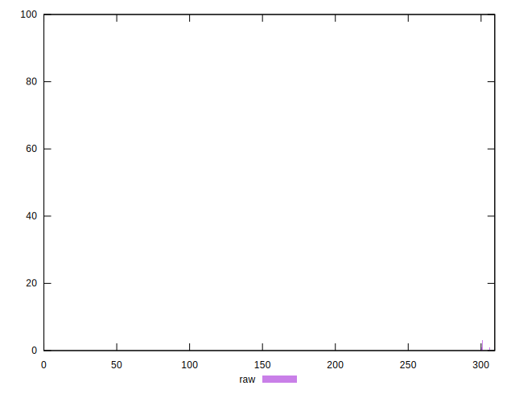
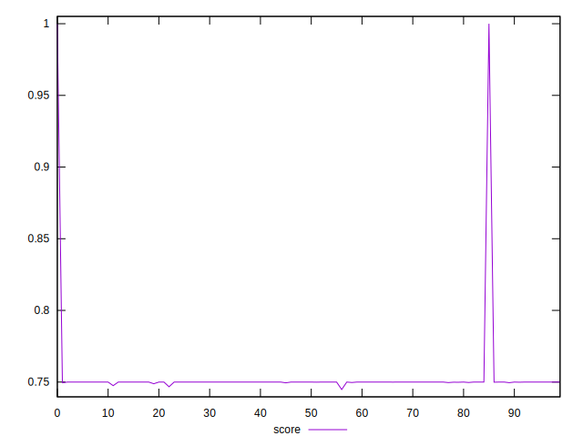
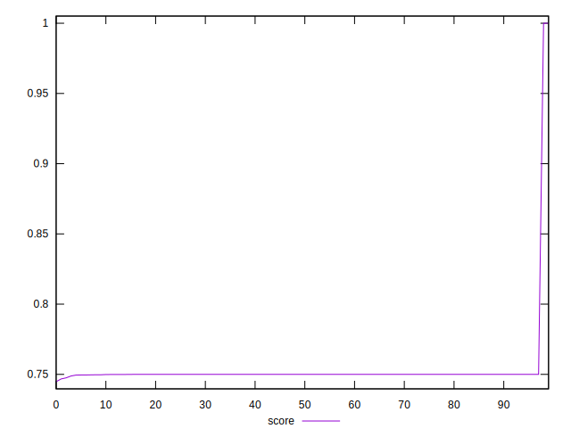
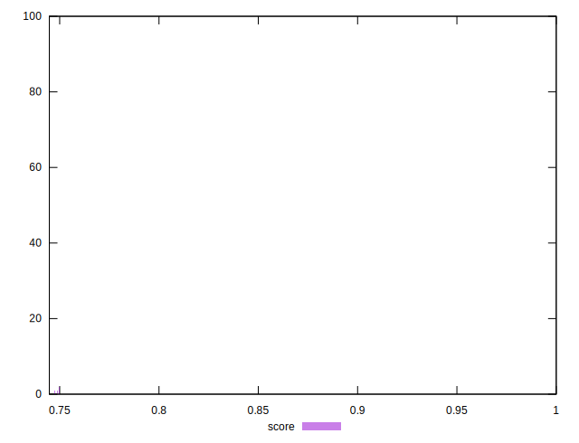

# //uses-rel-preconnect/samples/pages

[→ Parent](../..)


## Raw


```yaml
p90min: 300
p90max: 300.636
p90range: 0.6360000000000241
p90mean: 300.0294065934065
p90median: 300
p90stdev: 0.10784502291490473
p90skewness: 4.3552057343936115
p90eccentricity: 1.0000000000000013
p90discretization: 7.583333333333333
outlandishness: 0.9619776495068586

```


## Score


```yaml
p90min: 0.7496466666666667
p90max: 0.75
p90range: 0.0003533333333333166
p90mean: 0.7499836630036628
p90median: 0.75
p90stdev: 0.00005991390161938677
p90skewness: -4.355205734394316
p90eccentricity: 1.0000000000000024
p90discretization: 7.583333333333333
outlandishness: 1.0130189550954523

```


## P Score


```yaml
p90min: 0.7496466666666667
p90max: 0.75
p90range: 0.0003533333333333166
p90mean: 0.7499836630036628
p90median: 0.75
p90stdev: 0.00005991390161938677
p90skewness: -4.355205734394316
p90eccentricity: 1.0000000000000024
p90discretization: 7.583333333333333
outlandishness: 1.0130189550954523

```


## Score Difference


```yaml
p90min: 0
p90max: 0.0002955555555554934
p90range: 0.0002955555555554934
p90mean: 0.000009169719169719461
p90median: 0
p90stdev: 0.00003766794109902049
p90skewness: 5.59458563189349
p90eccentricity: 0.9999999999999962
p90discretization: 9.1
outlandishness: 29.877796493445032

```


## P Score Difference


```yaml
p90min: 0
p90max: 0
p90range: 0
p90mean: 0
p90median: 0
p90stdev: 0
p90skewness: .nan
p90eccentricity: .nan
p90discretization: 91
outlandishness: .nan

```

