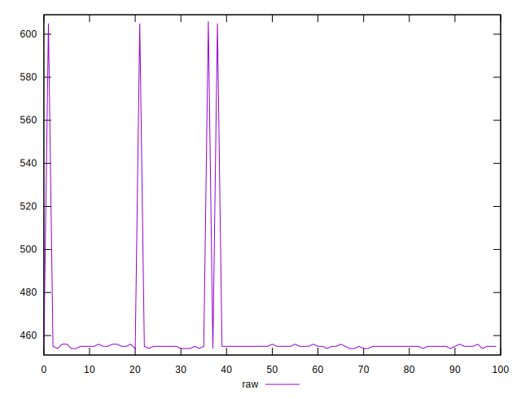
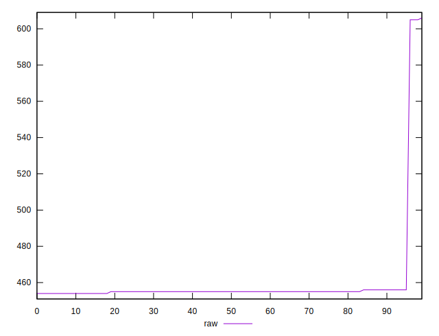
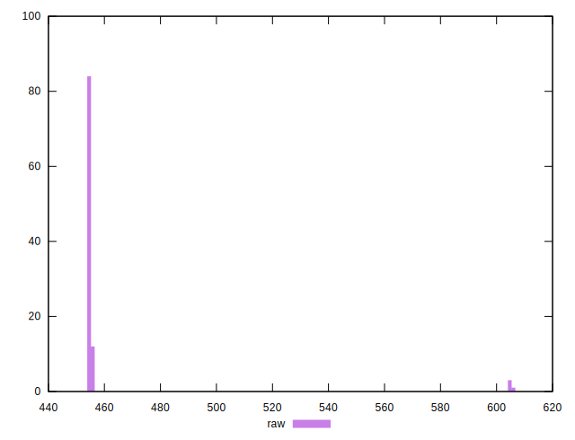
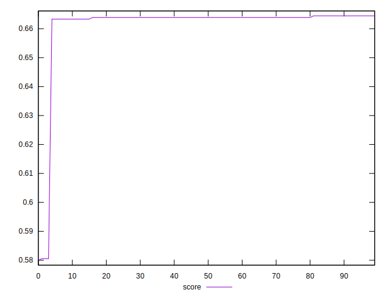

# //uses-rel-preload/samples/pages+cached+noadtech

[→ Parent](../..)


## Raw


```yaml
p90min: 454
p90max: 456
p90range: 2
p90mean: 454.85555555555555
p90median: 455
p90stdev: 0.5068664323536463
p90skewness: -0.23115733255832596
p90eccentricity: 0.9999999999999982
p90discretization: 30
outlandishness: 1.0269322386739645

```


## Score


```yaml
p90min: 0.58
p90max: 0.6644444444444444
p90range: 0.08444444444444443
p90mean: 0.6601604938271609
p90median: 0.6638888888888889
p90stdev: 0.01720015401014974
p90skewness: -4.419444534663745
p90eccentricity: 0.9999999999999989
p90discretization: 18
outlandishness: 1.0012982723565025

```

