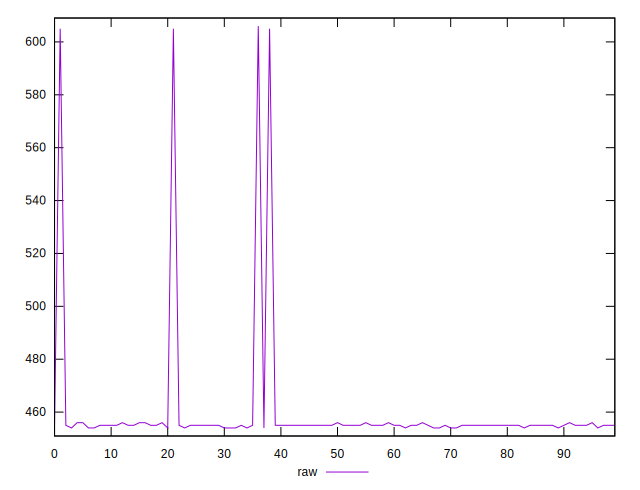
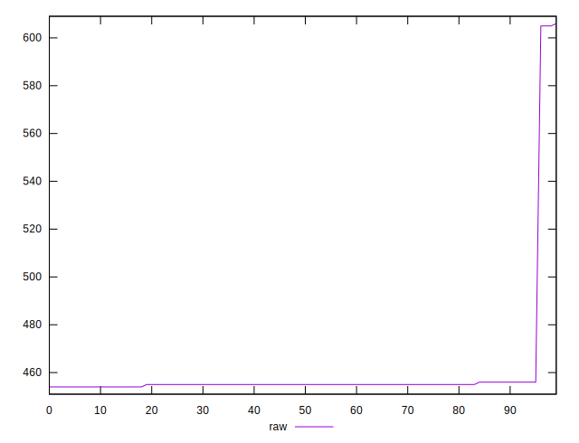
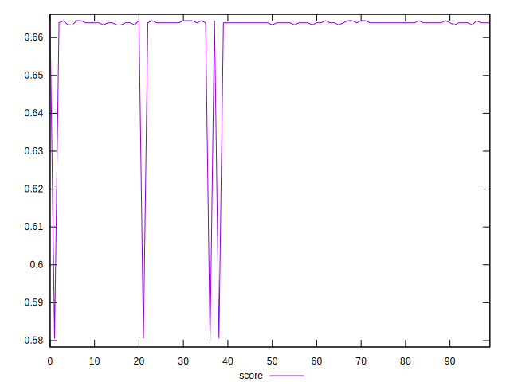
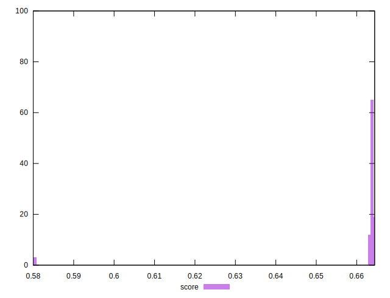

# //uses-rel-preload/samples/pages+cached+noadtech

[→ Parent](../..)


## Raw


```yaml
p90min: 454
p90max: 456
p90range: 2
p90mean: 454.97802197802196
p90median: 455
p90stdev: 0.5340704562735323
p90skewness: -0.020750182332689496
p90eccentricity: 1.0000000000000002
p90discretization: 30.333333333333332
outlandishness: 1.026379474429238

```


## Score


```yaml
p90min: 0.6633333333333333
p90max: 0.6644444444444444
p90range: 0.0011111111111110628
p90mean: 0.6639010989010997
p90median: 0.6638888888888889
p90stdev: 0.00029670580904083847
p90skewness: 0.020750182328763245
p90eccentricity: 1.0000000000000024
p90discretization: 30.333333333333332
outlandishness: 0.990046867850438

```

