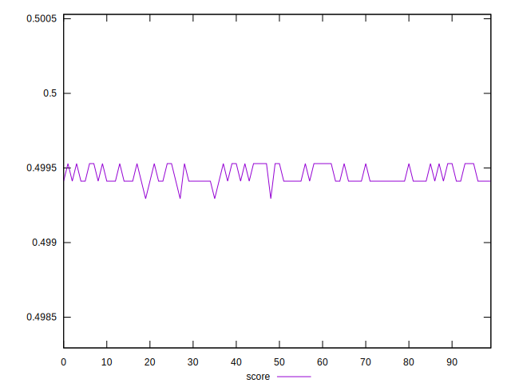

# //uses-rel-preload/samples/pages+cached+noexternal+nocss

[→ Parent](../..)


## Raw


```yaml
p90min: 754
p90max: 755
p90range: 1
p90mean: 754.5888888888888
p90median: 755
p90stdev: 0.4920353294552117
p90skewness: -0.36131100174145575
p90eccentricity: 1.0000000000000024
p90discretization: 45
outlandishness: 1.0002149924856862

```


## Score


```yaml
p90min: 0.49929411764705883
p90max: 0.4995294117647059
p90range: 0.00023529411764705577
p90mean: 0.49944183006535947
p90median: 0.49941176470588233
p90stdev: 0.00006215682838154394
p90skewness: 0.1685788977698873
p90eccentricity: 0.9999999999999986
p90discretization: 30
outlandishness: 1.000035072139331

```

