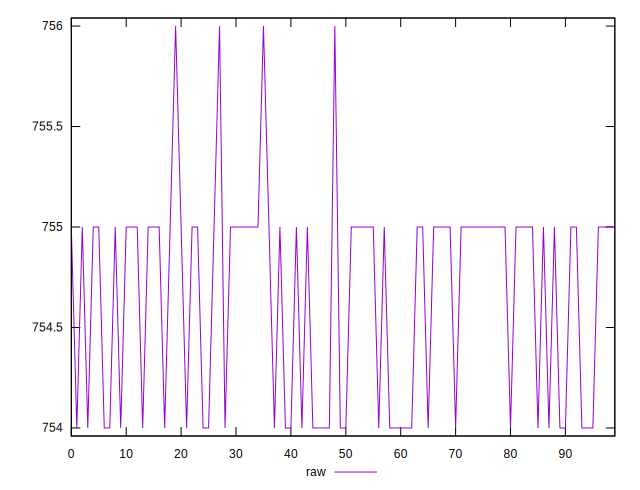
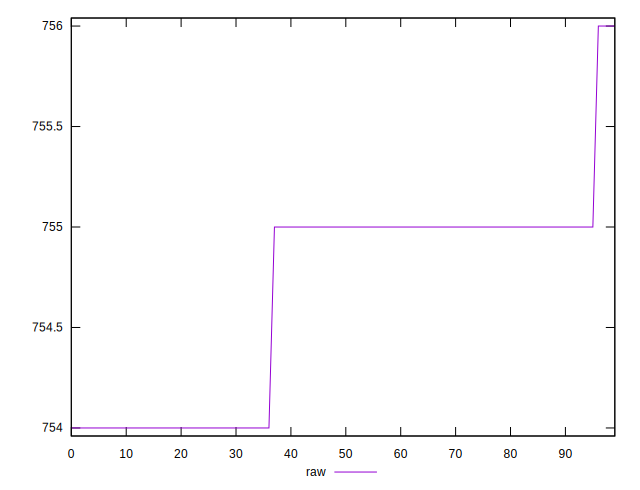
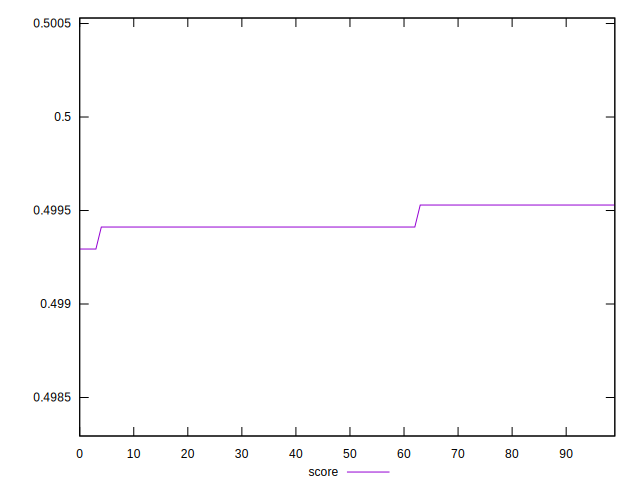

# //uses-rel-preload/samples/pages+cached+noexternal+nocss

[→ Parent](../..)


## Raw


```yaml
p90min: 754
p90max: 755
p90range: 1
p90mean: 754.6483516483516
p90median: 755
p90stdev: 0.4774848567560533
p90skewness: -0.621387867081378
p90eccentricity: 1.0000000000000016
p90discretization: 45.5
outlandishness: 1.0000573741719854

```


## Score


```yaml
p90min: 0.49941176470588233
p90max: 0.4995294117647059
p90range: 0.00011764705882355564
p90mean: 0.499453135100194
p90median: 0.49941176470588233
p90stdev: 0.00005617468903013647
p90skewness: 0.6213878670819882
p90eccentricity: 1.0000000000000013
p90discretization: 45.5
outlandishness: 0.9999898014118751

```

