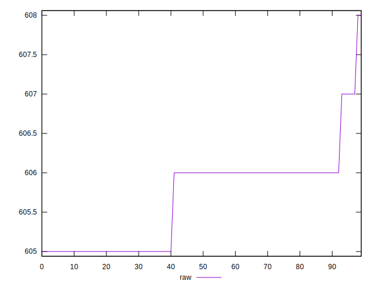
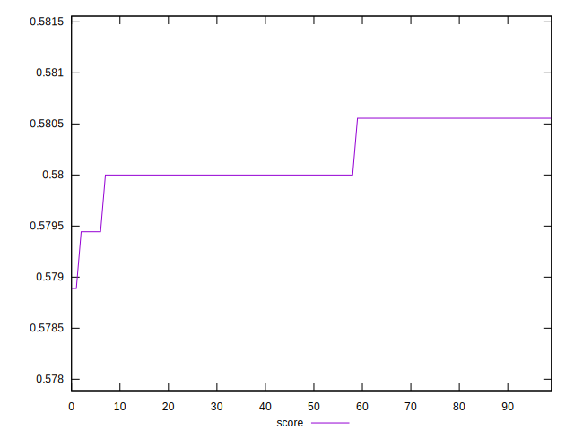

# //uses-rel-preload/samples/pages+cached+noexternal+nofonts+nosvg+noimg+nocss

[→ Parent](../..)


## Raw


```yaml
p90min: 605
p90max: 606
p90range: 1
p90mean: 605.5714285714286
p90median: 606
p90stdev: 0.4948716593053936
p90skewness: -0.28867513459471406
p90eccentricity: 0.9999999999999999
p90discretization: 45.5
outlandishness: 1.000358607279677

```


## Score


```yaml
p90min: 0.58
p90max: 0.5805555555555555
p90range: 0.0005555555555555314
p90mean: 0.5802380952380946
p90median: 0.58
p90stdev: 0.00027492869961409584
p90skewness: 0.2886751346005226
p90eccentricity: 0.9999999999999978
p90discretization: 45.5
outlandishness: 0.9997921049109898

```

