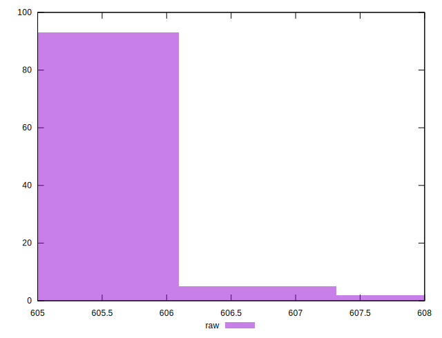
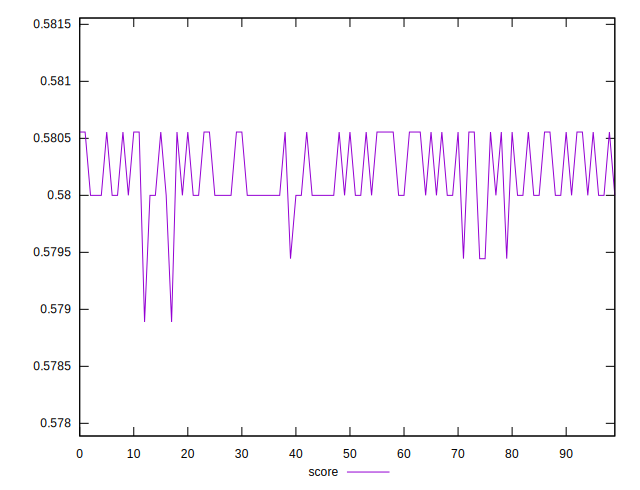

# //uses-rel-preload/samples/pages+cached+noexternal+nofonts+nosvg+noimg+nocss

[→ Parent](../..)


## Raw


```yaml
p90min: 605
p90max: 606
p90range: 1
p90mean: 605.5444444444445
p90median: 606
p90stdev: 0.4980207740225544
p90skewness: -0.1784842993014775
p90eccentricity: 1.0000000000000002
p90discretization: 45
outlandishness: 1.0004477647490646

```


## Score


```yaml
p90min: 0.5788888888888889
p90max: 0.5805555555555555
p90range: 0.0016666666666665941
p90mean: 0.5801358024691352
p90median: 0.58
p90stdev: 0.00036393587587612414
p90skewness: -0.7761617702965006
p90eccentricity: 1.0000000000000029
p90discretization: 22.5
outlandishness: 1.0001447137963562

```

