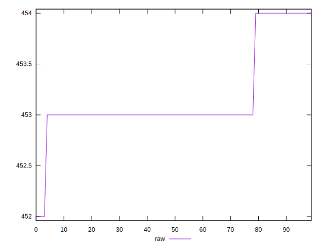

# //uses-rel-preload/samples/pages+cached+noexternal+nofonts+nosvg+noimg

[→ Parent](../..)


## Raw


```yaml
p90min: 453
p90max: 454
p90range: 1
p90mean: 453.1758241758242
p90median: 453
p90stdev: 0.38067050715799505
p90skewness: 1.7031832941093963
p90eccentricity: 1.0000000000000022
p90discretization: 45.5
outlandishness: 0.9999742963411218

```


## Score


```yaml
p90min: 0.6644444444444444
p90max: 0.665
p90range: 0.0005555555555556424
p90mean: 0.6649023199023192
p90median: 0.665
p90stdev: 0.0002114836150878079
p90skewness: -1.7031832940973397
p90eccentricity: 1.0000000000000018
p90discretization: 45.5
outlandishness: 1.0000097327412218

```

