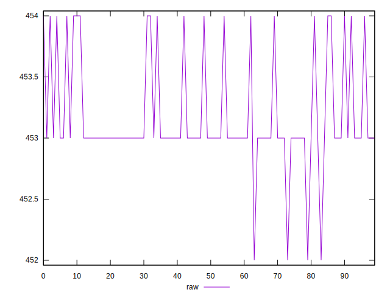
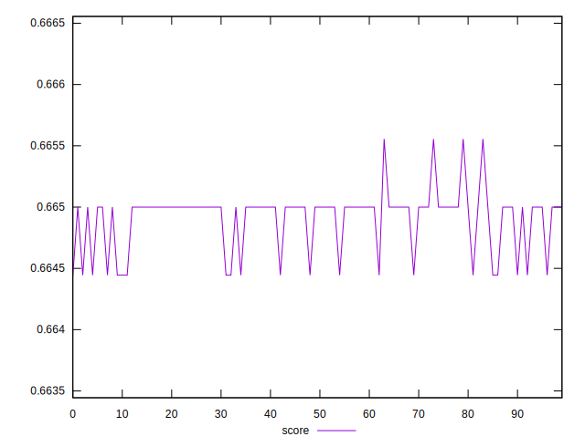
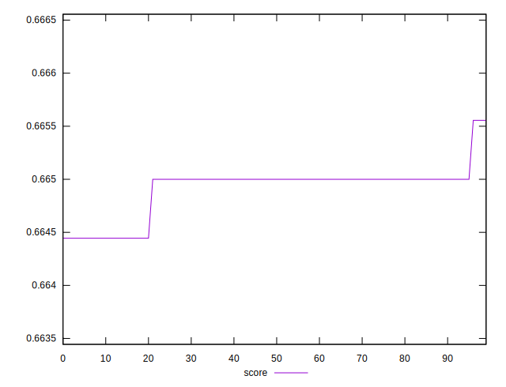
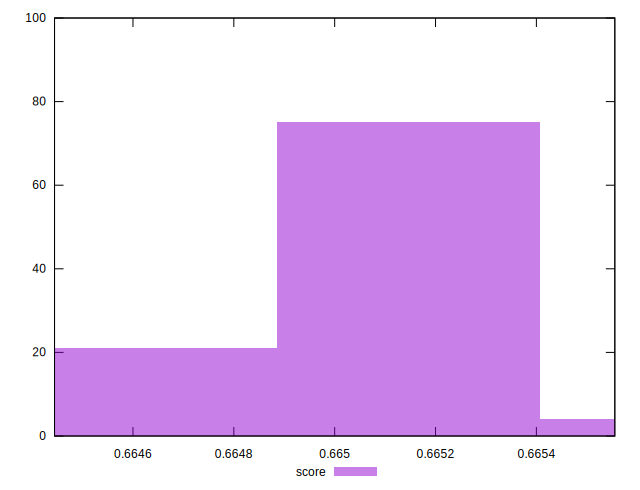

# //uses-rel-preload/samples/pages+cached+noexternal+nofonts+nosvg+noimg

[→ Parent](../..)


## Raw


```yaml
p90min: 452
p90max: 454
p90range: 2
p90mean: 453.0777777777778
p90median: 453
p90stdev: 0.40077086215269825
p90skewness: 0.618758022600635
p90eccentricity: 1.0000000000000009
p90discretization: 30
outlandishness: 1.0004071336643885

```


## Score


```yaml
p90min: 0.6644444444444444
p90max: 0.665
p90range: 0.0005555555555556424
p90mean: 0.6648703703703698
p90median: 0.665
p90stdev: 0.00023497365815650936
p90skewness: -1.2609766499677293
p90eccentricity: 1.0000000000000024
p90discretization: 45
outlandishness: 1.000105843538108

```

