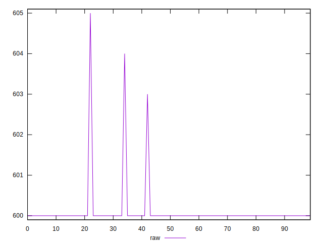
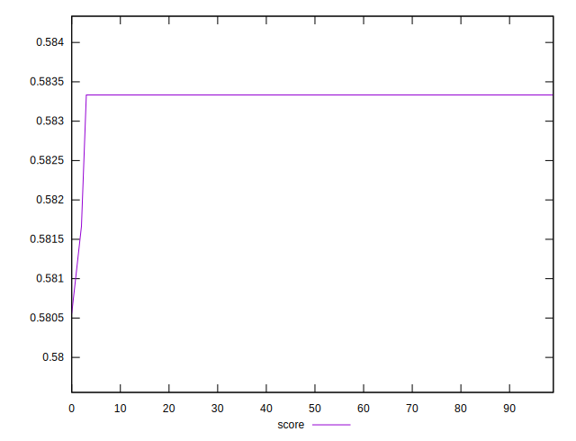

# //uses-rel-preload/samples/pages+cached+noexternal+nofonts

[→ Parent](../..)


## Raw


```yaml
p90min: 600
p90max: 600
p90range: 0
p90mean: 600
p90median: 600
p90stdev: 0
p90skewness: .nan
p90eccentricity: .nan
p90discretization: 90
outlandishness: 1.00040004

```


## Score


```yaml
p90min: 0.5805555555555555
p90max: 0.5833333333333334
p90range: 0.002777777777777879
p90mean: 0.5832592592592599
p90median: 0.5833333333333334
p90stdev: 0.00040740740740741736
p90skewness: -5.534184823444838
p90eccentricity: 0.9999999999999974
p90discretization: 22.5
outlandishness: 1.000025400212091

```

