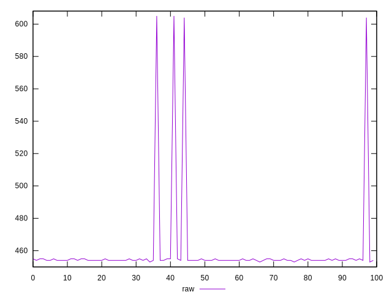
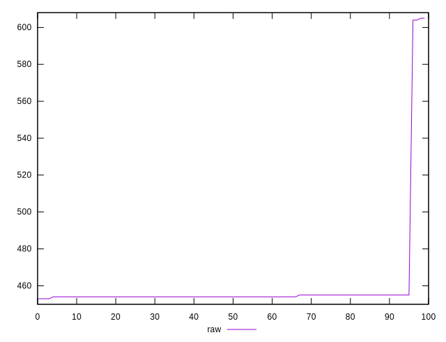
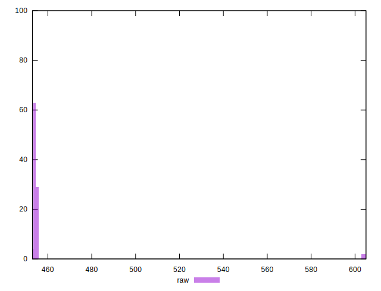
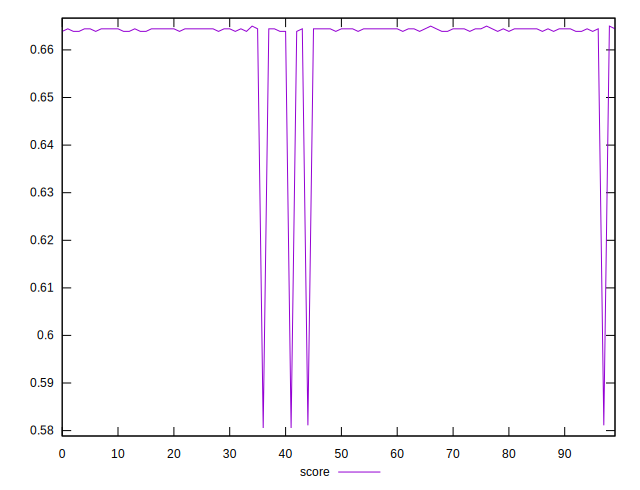
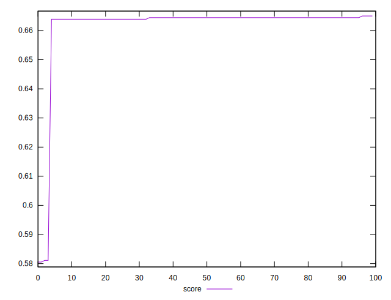
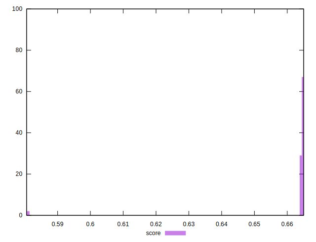

# //uses-rel-preload/samples/pages+cached+noexternal+noimg

[→ Parent](../..)


## Raw


```yaml
p90min: 453
p90max: 455
p90range: 2
p90mean: 454.2111111111111
p90median: 454
p90stdev: 0.5054029073575186
p90skewness: 0.309294096181195
p90eccentricity: 0.9999999999999982
p90discretization: 30
outlandishness: 1.0268566735253786

```


## Score


```yaml
p90min: 0.5805555555555555
p90max: 0.6644444444444444
p90range: 0.0838888888888889
p90mean: 0.6605493827160482
p90median: 0.6644444444444444
p90stdev: 0.017194022002518072
p90skewness: -4.419607688816383
p90eccentricity: 0.9999999999999982
p90discretization: 22.5
outlandishness: 1.0012470126336521

```

